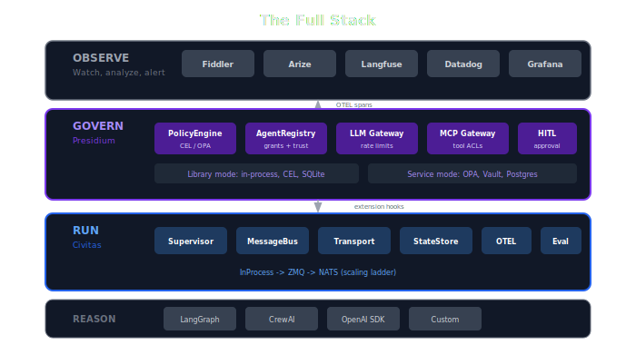
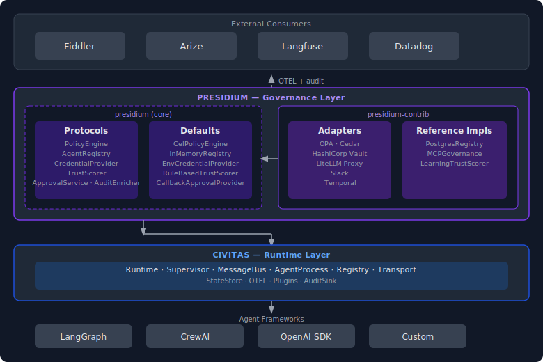
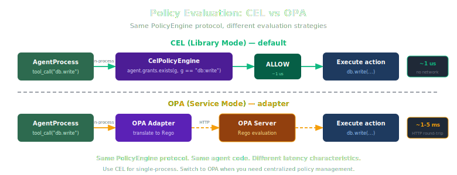
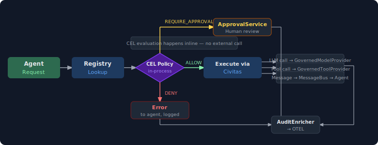

# Architecture Overview

> How Presidium's components fit together.

## System Architecture

## Key Design Decisions

### 1. Governance as Supervisor Constraints

Traditional governance tools intercept agent actions externally — a proxy, a sidecar, a middleware layer. Presidium integrates governance directly into Civitas's supervision tree:

- A **policy** is a supervisor configuration: what restart strategy, what resource limits, what actions are allowed
- An **agent's capabilities** determine which supervisor tree it belongs to
- **Trust scores** influence restart behavior — low-trust agents get stricter supervision

This means governance isn't a layer that can be bypassed. It's the runtime itself.

### 2. Registry as Source of Truth

Every agent in Presidium has an identity in the registry before it can run. The registry determines:

- What capabilities the agent has
- What policies apply to it
- What supervisor tree it belongs to
- What LLM providers and tools it can access
- What trust score it starts with

This is the inverse of the typical pattern where agents are deployed first and governed second.

### 3. Gateways as Civitas Plugins

LLM and MCP gateways are implemented as Civitas plugins (ModelProvider, ToolProvider), not external proxies. This means:

- Rate limiting uses Civitas's bounded mailbox mechanism
- Cost tracking is per-agent, integrated with the registry
- Tool access control is enforced at the message bus level
- All gateway activity generates OTEL spans automatically

### 4. Eval as Feedback Loop

The eval framework doesn't just score — it feeds back into governance:

- Policy compliance rates inform trust score adjustments
- Repeated violations can trigger automatic policy tightening
- Eval results are exported to external platforms (Fiddler, Arize) for dashboarding

### 5. Interface-First Architecture

`presidium` (core) contains only Protocol definitions and lightweight defaults. `presidium-contrib` contains adapters for existing products and reference implementations for novel components.

This follows the Civitas pattern: `civitas` defines `ModelProvider`, `ToolProvider`, `StateStore` protocols. `civitas-contrib` has `AnthropicProvider`, `SQLiteStateStore`, and so on. Presidium does the same for governance.

The benefit: you can swap any component without touching the rest of the system. OPA today, CEL tomorrow. Vault in production, env vars in development. Same interface throughout.

### 6. CEL as Default Policy Language

CEL (Common Expression Language) is the default policy engine, not OPA.

- **Embeddable**: `cel-python` runs in-process. No sidecar, no network call, no separate process to manage.
- **Kubernetes direction**: Kubernetes is adopting CEL for admission policies (ValidatingAdmissionPolicy). The ecosystem is moving this way.
- **Simpler syntax**: CEL expressions are closer to Python than Rego. Lower learning curve for teams already writing Python.
- **Fast**: In-process evaluation adds microseconds, not milliseconds.

OPA remains available as an adapter in `presidium-contrib` for teams that already run OPA and want to reuse their Rego policies.

### 7. Library-First, Service-Optional

Every component starts as an in-process library. Service mode is an upgrade path, not a requirement.

- **Library mode**: `CelPolicyEngine` evaluates policies in-process. `InMemoryRegistry` stores agent records in memory. `EnvCredentialProvider` reads from environment variables. Zero infrastructure.
- **Service mode**: `PolicyService` GenServer on the Civitas bus. `RegistryService` backed by Postgres. `Vault` for credentials. Same interfaces, different implementations.

A team can start with `pip install presidium` and a YAML policy file, then migrate individual components to service mode as their deployment grows. The application code doesn't change.

## Data Flow

CEL evaluation happens inline — no external call, no network hop. The policy check is part of the request path, not a separate service call.

## Startup Sequence

1. **Registry loads** — agent definitions from YAML topology or programmatic config
2. **Policies load** — CEL expressions compiled and attached to registry entries
3. **Gateways initialize** — `GovernedModelProvider` and `GovernedToolProvider` register as Civitas plugins
4. **Civitas Runtime starts** — supervision trees built from registry + policy config
5. **Agents start** — each agent gets its registered identity, policies, and capabilities
6. **Eval loop starts** — begins collecting governance metrics
7. **Export backends connect** — Fiddler, Arize, etc. start receiving telemetry
