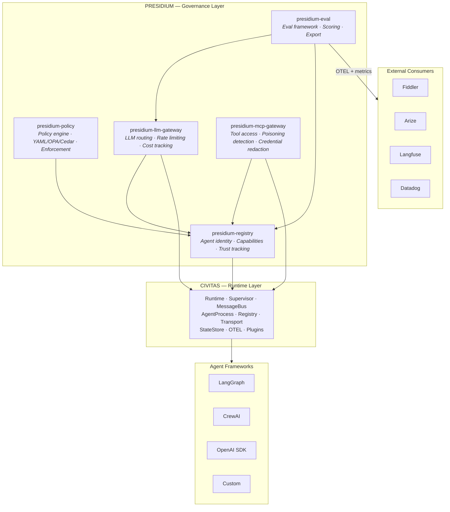
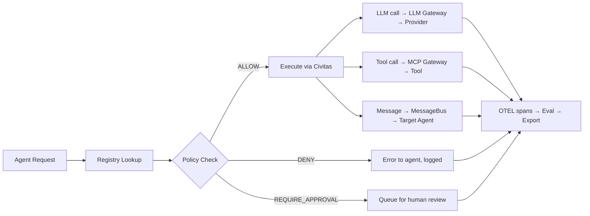

# Architecture Overview

> How Presidium's components fit together.

## System Architecture

## Key Design Decisions

### 1. Governance as Supervisor Constraints

Traditional governance tools intercept agent actions externally — a proxy, a sidecar, a middleware layer. Presidium integrates governance directly into Civitas's supervision tree:

- A **policy** is a supervisor configuration: what restart strategy, what resource limits, what actions are allowed
- An **agent's capabilities** determine which supervisor tree it belongs to
- **Trust scores** influence restart behavior — low-trust agents get stricter supervision

This means governance isn't a layer that can be bypassed. It's the runtime itself.

### 2. Registry as Source of Truth

Every agent in Presidium has an identity in the registry before it can run. The registry determines:

- What capabilities the agent has
- What policies apply to it
- What supervisor tree it belongs to
- What LLM providers and tools it can access
- What trust score it starts with

This is the inverse of the typical pattern where agents are deployed first and governed second.

### 3. Gateways as Civitas Plugins

LLM and MCP gateways are implemented as Civitas plugins (ModelProvider, ToolProvider), not external proxies. This means:

- Rate limiting uses Civitas's bounded mailbox mechanism
- Cost tracking is per-agent, integrated with the registry
- Tool access control is enforced at the message bus level
- All gateway activity generates OTEL spans automatically

### 4. Eval as Feedback Loop

The eval framework doesn't just score — it feeds back into governance:

- Policy compliance rates inform trust score adjustments
- Repeated violations can trigger automatic policy tightening
- Eval results are exported to external platforms (Fiddler, Arize) for dashboarding

## Data Flow

## Startup Sequence

1. **Registry loads** — agent definitions from YAML topology or programmatic config
2. **Policies load** — policy definitions compiled and attached to registry entries
3. **Gateways initialize** — LLM and MCP gateways register as Civitas plugins
4. **Civitas Runtime starts** — supervision trees built from registry + policy config
5. **Agents start** — each agent gets its registered identity, policies, and capabilities
6. **Eval loop starts** — begins collecting governance metrics
7. **Export backends connect** — Fiddler, Arize, etc. start receiving telemetry
