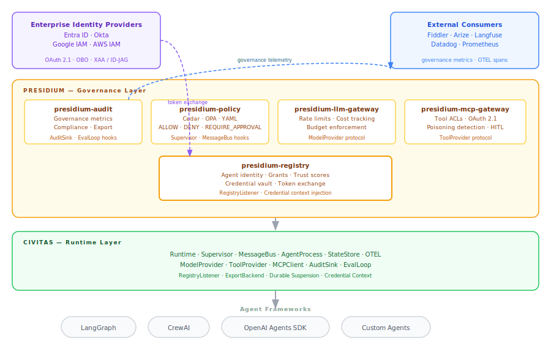
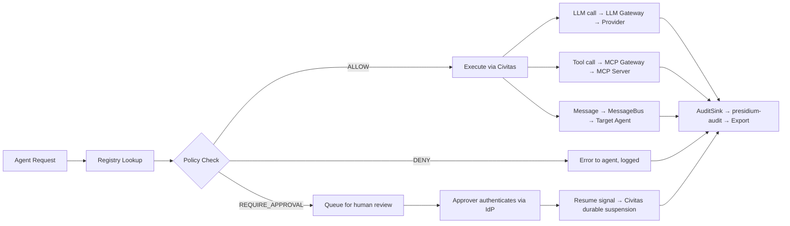

# Architecture Overview

> How Presidium's components fit together.

## System Architecture



---

## Key Design Decisions

### 1. Governance as Supervisor Constraints

Traditional governance tools intercept agent actions externally — a proxy, a sidecar, a middleware layer. Presidium integrates governance directly into Civitas's supervision tree:

- A **policy** is a supervisor configuration: restart strategy, resource limits, allowed actions
- An agent's **grants** determine which resources (LLMs, tools, APIs) it can reach — enforced at the gateway level before any call is made
- **Trust scores** influence runtime behavior — low-trust agents get stricter supervision and may be suspended

This means governance isn't a layer that can be bypassed. It's the runtime itself.

### 2. Registry as Source of Truth

Every agent in Presidium has an identity in the registry before it can run. The registry determines:

- What **grants** the agent holds (authorization entitlements — distinct from Civitas capability routing tags)
- What **policies** apply to it
- What **supervisor tree** it belongs to
- What **LLM providers and tools** it can access
- What **trust score** it starts with
- What **credentials** are issued to it at startup (via credential vault)

This is the inverse of the typical pattern where agents are deployed first and governed second.

### 3. Gateways as Civitas Plugins

LLM and MCP gateways are implemented as Civitas plugins (`ModelProvider`, `ToolProvider`), not external proxies. This means:

- Rate limiting and budget enforcement happen inline with agent execution
- Cost tracking is per-agent, cross-referenced with the registry
- Tool ACLs are enforced at the message bus level — not after the fact
- All gateway activity generates OTEL spans automatically

### 4. Audit as External Accountability

`presidium-audit` aggregates governance metrics and exports them to external platforms. It does not replace Civitas's `EvalLoop` (which handles agent self-correction signals). These are distinct streams:

- `EvalLoop` (Civitas): Did the agent produce a good output? Internal quality signal.
- `presidium-audit` (Presidium): Did the agent comply with policy? External accountability signal.

Compliance, trust drift, denial counts, and budget utilization are the audit layer's outputs — consumed by Fiddler, Arize, Langfuse, or any SIEM for dashboarding and compliance reporting.

---

## The Eight Integration Points

Presidium extends Civitas at exactly eight surfaces. Outside these points, the two layers are fully independent.

| # | Hook | Civitas Provides | Presidium Consumes |
|---|------|-----------------|-------------------|
| 1 | `RegistryListener` | Async callback on every agent register/deregister, carrying name + capability tags | Populates `AgentRecord` in persistent Agent Registry |
| 2 | `ModelProvider` protocol | `chat(messages, agent_name, **kwargs) → ModelResponse` | `GovernedModelProvider` wraps any provider with rate limits, cost tracking, grant checks |
| 3 | `ToolProvider` protocol | Interface for tool calls via MCP client | `GovernedToolProvider` wraps with tool ACLs, poisoning detection, credential redaction |
| 4 | `AuditSink` | Pipeline: agent emits structured audit events | Audit sink aggregates, enriches with governance context, exports to external platforms |
| 5 | `ExportBackend` | Interface for telemetry export | Presidium implements: `FiddlerExporter`, `ArizeExporter`, `LangfuseExporter` |
| 6 | `EvalLoop` hooks | Correction signal infrastructure for agent self-improvement | Presidium attaches governance metrics alongside self-correction signals (distinct streams) |
| 7 | Credential context injection | Agent receives a `credentials` context dict at startup | Presidium populates it: agent client credentials, initial token, vault endpoint, agent grants |
| 8 | Durable suspension | `AgentProcess` can suspend execution awaiting an external signal | Presidium HITL service sends the resume signal after human approval decision |

---

## AAA Across the Stack

Authentication, Authorization, and Access Control span both layers:

```
Enterprise IdP (Entra, Okta, Google IAM, AWS IAM)
  ↑  OBO / XAA / client credentials token exchange
Presidium credential vault + policy engine
  ↑  Grant check + policy decision (ALLOW / DENY / REQUIRE_APPROVAL)
Presidium LLM/MCP Gateway (GovernedModelProvider / GovernedToolProvider)
  ↑  Civitas ModelProvider / ToolProvider protocol
Civitas AgentProcess
  ↑  mTLS (transport security between nodes)
Civitas Runtime
```

- **Civitas** handles transport-level security (mTLS between nodes) and emits audit events.
- **Presidium** handles application-level authentication (token issuance, OBO exchange), authorization (Cedar policy engine, grant checks), and access control enforcement (at the gateway).
- **Enterprise IdPs** are integrated, not replaced. Presidium delegates identity issuance to Entra, Okta, Google IAM, or AWS IAM; it operates as the authorization server that wraps and enforces IdP-issued identities with agent-specific governance policy.

For the full AAA architecture including HITL approval auth and the canonical credential flow, see [RFC-001](../rfcs/001-presidium-scope.md#aaa-architecture-holistic-view).

---

## Data Flow



---

## Startup Sequence

1. **Registry loads** — agent definitions from YAML topology or programmatic config; subscribes to Civitas `RegistryListener`
2. **Credential vault initializes** — connects to configured IdP(s); establishes token exchange endpoints
3. **Policies load** — policy definitions compiled and attached to registry entries
4. **Gateways initialize** — `GovernedModelProvider` and `GovernedToolProvider` register as Civitas plugins
5. **Civitas Runtime starts** — supervision trees built from registry + policy config
6. **Agents start** — each agent receives its registered identity, grants, and credential context (integration point 7)
7. **Audit loop starts** — `presidium-audit` begins collecting governance metrics via `AuditSink`
8. **Export backends connect** — Fiddler, Arize, Langfuse, etc. start receiving governance telemetry
