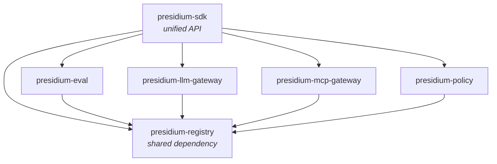

# Package Map

> What each package does, its boundaries, and dependencies.

## Overview

Presidium is a monorepo with independently installable packages. Each package owns a specific governance concern and integrates with Civitas at well-defined extension points.



---

## presidium-registry

**Agent identity, capability registration, and trust tracking.**

### Responsibility

- Define agent identities (name, version, owner, capabilities)
- Track agent lifecycle states (registered, starting, running, stopped, suspended)
- Maintain trust scores based on runtime behavior
- Provide lookup APIs for other packages (policy, gateways, eval)

### Civitas Integration Point

- Extends `civitas.Registry` — adds governance metadata to agent registrations
- Hooks into `AgentProcess.on_start()` / `on_stop()` for lifecycle tracking

### Key Types (Planned)

```python
@dataclass
class AgentRecord:
    name: str
    version: str
    owner: str
    capabilities: list[str]
    trust_score: float
    policies: list[str]
    state: AgentState

class AgentRegistry(Protocol):
    async def register(self, record: AgentRecord) -> None: ...
    async def lookup(self, name: str) -> AgentRecord | None: ...
    async def update_trust(self, name: str, delta: float) -> None: ...
```

### Depends On

- `civitas` (registry, process)

---

## presidium-policy

**Policy definition, evaluation, and enforcement.**

### Responsibility

- Define policies in YAML (primary), with OPA Rego and Cedar support planned
- Evaluate agent actions against applicable policies
- Enforce decisions: ALLOW, DENY, REQUIRE_APPROVAL
- Integrate with Civitas supervisors (policies as supervisor config)

### Civitas Integration Point

- Hooks into `Supervisor` — policies determine restart strategies, resource limits
- Hooks into `MessageBus` — action-level enforcement before message delivery

### Key Types (Planned)

```python
class PolicyDecision(Enum):
    ALLOW = "allow"
    DENY = "deny"
    REQUIRE_APPROVAL = "require_approval"

class PolicyEngine(Protocol):
    async def evaluate(
        self,
        agent: str,
        action: str,
        context: dict[str, Any],
    ) -> PolicyDecision: ...

# YAML policy example:
# policies:
#   - name: read-only-analyst
#     agents: ["analyst-*"]
#     rules:
#       - action: "write_*"
#         decision: deny
#       - action: "delete_*"
#         decision: deny
#       - action: "read_*"
#         decision: allow
```

### Depends On

- `civitas` (supervisor, bus)
- `presidium-registry` (agent lookup)

---

## presidium-llm-gateway

**LLM request routing, rate limiting, and cost tracking.**

### Responsibility

- Route LLM requests to configured providers based on agent identity/policy
- Enforce per-agent rate limits (requests/minute, tokens/minute)
- Track cost per agent, per session, per provider
- Apply content filtering hooks (pre/post LLM call)
- Budget enforcement (hard limits, soft warnings)

### Civitas Integration Point

- Implements `civitas.plugins.ModelProvider` protocol
- Uses bounded mailboxes for rate limiting (native backpressure)

### Depends On

- `civitas` (plugins)
- `presidium-registry` (agent lookup for rate limits)
- `presidium-policy` (action-level checks)

---

## presidium-mcp-gateway

**Tool access governance via MCP (Model Context Protocol).**

### Responsibility

- Control which agents can access which tools
- Detect tool poisoning (tools changing behavior post-approval)
- Redact credentials from tool call parameters
- Audit log all tool interactions
- Enforce tool-level policies (some tools require approval)

### Civitas Integration Point

- Wraps `civitas.mcp` integration
- Implements `civitas.plugins.ToolProvider` protocol

### Depends On

- `civitas` (mcp, plugins)
- `presidium-registry` (agent capabilities determine tool access)
- `presidium-policy` (tool-level policies)

---

## presidium-eval

**Governance-aware evaluation and external platform integration.**

### Responsibility

- Define governance-specific evaluation metrics:
  - Policy compliance rate
  - Trust score trends
  - Action denial frequency
  - Approval queue depth
  - Cost efficiency
- Score agent behavior against governance criteria
- Export to external platforms (Fiddler, Arize, Langfuse, custom)
- Feed evaluation results back into trust scores

### Civitas Integration Point

- Extends `civitas.EvalLoop` with governance-specific metrics
- Implements `civitas.plugins.ExportBackend` for each external platform

### Depends On

- `civitas` (eval_loop, plugins)
- `presidium-registry` (trust score updates)
- `presidium-policy` (compliance metrics)

---

## presidium-sdk

**Unified developer API — the `pip install presidium` experience.**

### Responsibility

- Re-export all public APIs from sub-packages
- Provide convenience constructors and helpers
- CLI commands (`presidium run`, `presidium policy validate`, etc.)
- YAML topology extension (add governance config to Civitas topology files)
- Getting started experience

### Example API (Aspirational)

```python
from presidium import GovernedRuntime, Policy, AgentRecord

runtime = GovernedRuntime.from_topology("topology.yml")

# Or programmatic:
runtime = GovernedRuntime(
    policies=[
        Policy.read_only(agents=["analyst-*"]),
        Policy.rate_limit(agents=["*"], requests_per_minute=100),
    ],
    agents=[
        AgentRecord(name="analyst", capabilities=["read:data"]),
        AgentRecord(name="writer", capabilities=["read:data", "write:reports"]),
    ],
)

await runtime.start()
```

### Depends On

- All presidium packages
- `civitas`
