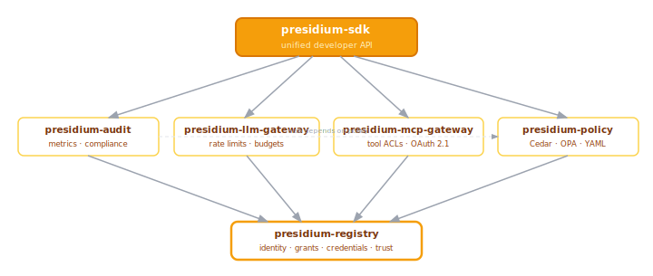

# Package Map

> What each package does, its boundaries, and dependencies.
> Last updated: 2026-05-05

## Overview

Presidium is a monorepo with independently installable packages. Each package owns a specific governance concern and integrates with Civitas at well-defined extension points.



---

## presidium-registry

**Agent identity, grants (authorization entitlements), credential vault, and trust tracking.**

### Responsibility

- Persistent agent identity: name, version, owner, registered_at, lifecycle state
- Agent **grants** — what an agent is *authorized to access* (tool namespaces, LLM tiers, data scopes). Note: distinct from Civitas capability routing tags (which are about message routing, not authorization — see [RFC-001](../rfcs/001-presidium-scope.md))
- Trust score tracking (float 0.0–1.0, starts at max, decays without positive signals)
- **Credential vault** — OAuth tokens, API keys, and client credentials scoped per `(agent_id, user_id)` tuple. KMS-encrypted at rest.
- **Token exchange service** — OBO (On-Behalf-Of), XAA/ID-JAG (user-delegated via enterprise IdP), OAuth 2.1 client credentials on behalf of agents
- **IdP integration surface** — Entra ID, Okta, Google IAM, AWS IAM. Presidium integrates with IdPs; it does not implement one.
- Lifecycle tracking: hooks into Civitas's `RegistryListener` to receive agent start/stop events

### Civitas Integration Points

- **`RegistryListener`** — subscribes to Civitas routing registry events; populates `AgentRecord` from agent announcements
- Credential context injection (integration point 7): populates the `credentials` context passed to agents at startup — client credentials, vault endpoint, initial token, agent grants

### Key Types (Planned)

```python
@dataclass
class AgentRecord:
    name: str
    version: str
    owner: str                         # Human accountable for this agent
    grants: list[str]                  # Authorization entitlements (NOT routing capability tags)
                                       # e.g. ["tool:database:read", "llm:claude-sonnet", "data:customer_pii:read"]
    policies: list[str]                # Policy names that apply to this agent
    trust_score: float = 1.0           # 0.0–1.0, starts at max
    state: AgentState = AgentState.REGISTERED
    metadata: dict[str, Any] = field(default_factory=dict)
    registered_at: datetime = field(default_factory=datetime.utcnow)

class AgentRegistry(Protocol):
    async def register(self, record: AgentRecord) -> None: ...
    async def lookup(self, name: str) -> AgentRecord | None: ...
    async def update_trust(self, name: str, delta: float) -> None: ...
    async def list_agents(self, filter: AgentFilter | None = None) -> list[AgentRecord]: ...

class CredentialVault(Protocol):
    async def get_agent_token(self, agent_name: str) -> str: ...
    async def get_user_delegated_token(self, agent_name: str, user_id: str, scope: str) -> str: ...
    async def store_token(self, agent_name: str, user_id: str, token: OAuthToken) -> None: ...
    async def exchange_obo(self, user_token: str, agent_name: str, target_scope: str) -> str: ...
```

### IdP Integration Surface

Integrates via standard protocols — no vendor lock-in:

| IdP | Protocol | Pattern |
|-----|----------|---------|
| Microsoft Entra ID | OAuth 2.1 + OBO (RFC 8693) | Agent gets Entra service principal; OBO exchange for user-delegated access |
| Okta | OAuth 2.1 + XAA (ID-JAG) | Enterprise broker pattern; no per-user consent fatigue |
| Google IAM | SPIFFE/Workload Identity + OAuth | Certificate-bound tokens; Workload Identity Federation |
| AWS IAM | SigV4 + AgentCore token vault pattern | IAM role per agent; scoped service role |
| Generic OIDC | OAuth 2.1 client credentials | Any compliant IdP (Auth0, Keycloak, etc.) |

### Depends On

- `civitas` (RegistryListener, AgentProcess lifecycle)

---

## presidium-policy

**Policy definition, evaluation, and enforcement.**

### Responsibility

- Define policies in YAML (primary); Cedar (primary engine); OPA (plugin adapter)
- Evaluate `(agent, action, resource, context)` → ALLOW / DENY / REQUIRE_APPROVAL
- Sub-millisecond evaluation target (must not add perceptible latency to tool calls)
- Integrate with Civitas supervisors (policies as supervisor constraints)
- Action-level enforcement: per tool call, per LLM request, per message type

### Civitas Integration Points

- Hooks into `Supervisor` — policies determine restart strategies and resource limits
- Hooks into `MessageBus` — action-level enforcement before message delivery

### Key Types (Planned)

```python
class PolicyDecision(Enum):
    ALLOW = "allow"
    DENY = "deny"
    REQUIRE_APPROVAL = "require_approval"

@dataclass
class PolicyResult:
    decision: PolicyDecision
    reason: str
    policy_name: str
    matched_rule: str

class PolicyEngine(Protocol):
    async def evaluate(
        self,
        agent: str,
        action: str,
        resource: str,
        context: dict[str, Any],
    ) -> PolicyResult: ...
```

### YAML Policy Example

```yaml
policies:
  - name: analyst-read-only
    agents: ["analyst-*"]
    rules:
      - action: "tool:*:write"
        decision: deny
        reason: "Analysts are read-only"
      - action: "tool:*:read"
        decision: allow
      - action: "llm:*"
        decision: allow
        constraints:
          rate_limit: { requests: 30, window: "1m" }

  - name: production-writes-require-approval
    agents: ["writer-*"]
    rules:
      - action: "tool:production_db:write"
        decision: require_approval
        approval:
          min_approvals: 1
          eligible_roles: ["senior-engineer", "tech-lead"]
          timeout_minutes: 30
```

### Depends On

- `civitas` (Supervisor, MessageBus)
- `presidium-registry` (agent lookup, grants)

---

## presidium-llm-gateway

**Governed LLM access: rate limiting, cost tracking, budget enforcement, grant-based routing.**

This is not a model router. It is a governance layer over LLM calls. Model routing without governance (e.g., multi-provider fallback for reliability) is a Civitas utility (`CompositeModelProvider`), not a Presidium concern.

### Responsibility

- `GovernedModelProvider` — wraps any Civitas `ModelProvider` (Anthropic, OpenAI, Gemini, etc.)
- Per-agent rate limits (requests/min, tokens/min) via configured policy
- Per-agent cost tracking and budget enforcement (daily/monthly limits per agent)
- Grant-based provider routing: agent's `grants` determine which LLM tiers are accessible (`llm:claude-opus`, `llm:claude-sonnet`, `llm:gpt-4o`, etc.)
- Budget action on exceed: `deny` | `warn` | `throttle` (configurable per policy)
- All LLM calls audited: model, tokens, cost, agent identity, user identity (if delegated)

### Civitas Integration Point

- Implements `civitas.plugins.ModelProvider` protocol — drop-in replacement; no agent code changes

### Topology YAML

```yaml
plugins:
  model:
    type: governed          # GovernedModelProvider
    config:
      underlying: anthropic # delegates to AnthropicProvider after governance checks
      rate_limits:
        default:
          requests_per_minute: 60
          tokens_per_minute: 100_000
        overrides:
          "analyst-*":
            requests_per_minute: 20
      budgets:
        default:
          daily_limit_usd: 5.00
          action_on_exceed: throttle
```

### Depends On

- `civitas` (ModelProvider protocol)
- `presidium-registry` (agent grants, credential vault for API keys)
- `presidium-policy` (rate limit and budget policies)

---

## presidium-mcp-gateway

**Governed tool access: ACLs, OAuth 2.1 for MCP, poisoning detection, credential redaction.**

### Responsibility

- `GovernedToolProvider` — wraps Civitas MCP client with access control
- Tool ACLs: agent's `grants` determine which tools are accessible (e.g. `tool:database:read` but not `tool:database:write`)
- **MCP OAuth 2.1**: token acquisition with PKCE + Resource Indicators (RFC 8707) per the March 2026 MCP specification. One token per MCP server endpoint, preventing token mis-redemption across servers.
- Tool poisoning detection: snapshot tool descriptions + parameter schemas at approval time; alert on changes post-approval
- Credential redaction: strip API keys and secrets from tool call logs and audit records
- Audit logging: all tool invocations logged with agent identity, user identity (if delegated), tool name, arguments hash, result status
- HITL integration: tool calls with `require_approval` policy decision are queued to the approval service

### Civitas Integration Points

- Implements `civitas.plugins.ToolProvider` protocol
- Wraps `civitas.mcp.MCPClient` — transparent to agent code

### MCP OAuth 2.1 Flow

```
Agent calls tool via GovernedToolProvider
  ↓
Gateway checks agent grants → "tool:database:read" present?
  ↓ yes
Gateway queries credential vault for this (agent_id, mcp_server_url) token
  ↓ miss or expired
Gateway initiates OAuth 2.1 + PKCE + Resource Indicators for this MCP server
  ↓
Vault stores token; gateway presents Bearer token to MCP server
  ↓
MCP server validates: signature + expiry + audience (resource indicator) + scopes
```

### Depends On

- `civitas` (MCPClient, ToolProvider protocol)
- `presidium-registry` (agent grants, credential vault)
- `presidium-policy` (tool-level policies, HITL trigger)

---

## presidium-audit

**Governance audit metrics, compliance reporting, and external platform integration.**

> Previously named `presidium-eval`. Renamed to distinguish from Civitas's `EvalLoop` (agent self-correction signals, which remain a Civitas concern). `presidium-audit` is about accountability to external parties, not agent self-improvement.

### Responsibility

- Governance metrics per agent per window:
  - Policy compliance rate (% of actions that passed policy)
  - Denial count and denial breakdown by rule
  - Approval queue depth and resolution time
  - Trust score delta and trend
  - Tool usage: authorized vs. unauthorized attempts
  - LLM budget utilization
  - Restart count and escalation count
- Compliance report generation (EU AI Act, NIST AI RMF, SOC 2 mapping — structured data, not certificate issuance)
- Export to external platforms: Fiddler, Arize, Langfuse, custom `GovernanceExporter` protocol
- Trust score feedback loop: compliance metrics feed back into `AgentRegistry.update_trust()`

### Civitas Integration Points

- **`AuditSink`** — subscribes to Civitas's audit event pipeline; enriches events with governance context before export
- **`ExportBackend`** protocol — implements Fiddler, Arize, Langfuse exporters
- **`EvalLoop` hooks** — attaches governance metrics alongside Civitas self-correction signals (distinct streams, not replacement)

### Key Types (Planned)

```python
@dataclass
class GovernanceMetrics:
    agent_name: str
    window_start: datetime
    window_end: datetime
    policy_compliance_rate: float
    denial_count: int
    approval_pending_count: int
    trust_score_delta: float
    tool_usage_authorized: float
    llm_budget_utilization: float
    restart_count: int
    mean_policy_eval_latency_ms: float

class GovernanceExporter(Protocol):
    async def export(self, agent_name: str, metrics: GovernanceMetrics) -> None: ...
```

### Depends On

- `civitas` (AuditSink, EvalLoop, ExportBackend protocol)
- `presidium-registry` (trust score updates)
- `presidium-policy` (compliance metrics source)

---

## presidium-sdk

**Unified developer API — the `pip install presidium` experience.**

### Responsibility

- Re-export all public APIs from sub-packages under a single import
- `GovernedRuntime` — wraps Civitas `Runtime` with governance wiring (injects `GovernedModelProvider`, `GovernedToolProvider`, `RegistryListener`, credential context)
- CLI: `presidium policy validate`, `presidium registry list`, `presidium audit export`, `presidium trust show`
- YAML topology extension: add `governance:` block to Civitas topology files
- Getting started experience and example applications

### Example API (Aspirational)

```python
from presidium import GovernedRuntime, Policy, AgentRecord

runtime = GovernedRuntime.from_topology("topology.yml")

# Or programmatic:
runtime = GovernedRuntime(
    policies=[
        Policy.read_only(agents=["analyst-*"]),
        Policy.rate_limit(agents=["*"], requests_per_minute=100, daily_budget_usd=10.00),
        Policy.require_approval(agents=["writer-*"], actions=["tool:production_db:write"]),
    ],
    agents=[
        AgentRecord(name="analyst", grants=["tool:database:read", "llm:claude-haiku"]),
        AgentRecord(name="writer", grants=["tool:database:read", "tool:database:write", "llm:claude-sonnet"]),
    ],
    idp=EntraIDConfig(tenant_id="...", client_id="...", client_secret="..."),
)

await runtime.start()
```

### Depends On

- All presidium packages
- `civitas`
