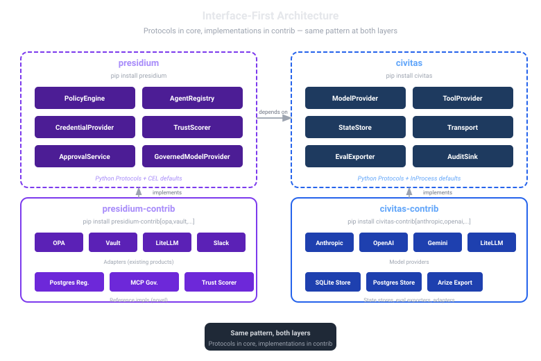
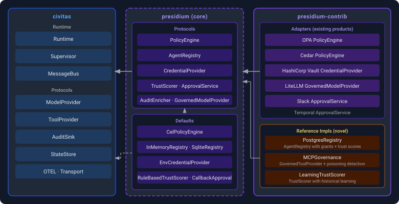
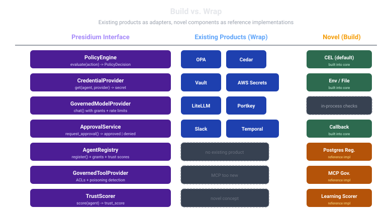

# Package Map

> What each package does, its boundaries, and dependencies.
> Last updated: 2026-07-07



## Overview

Presidium ships as two packages. `presidium` is the interface library: pure Protocol definitions, no heavy dependencies, installable anywhere. `presidium-contrib` is the adapters and reference implementations: OPA, OpenBao, AgentGateway, LiteLLM, Slack, several stubbed gateway-backend adapters (Kong, Portkey, Cloudflare AI Gateway, Helicone, TrueFoundry), and reference implementations for components whose prior art (e.g. Microsoft AGT, Google Gemini) isn't available as a standalone, swappable library.

This follows the same pattern as Civitas (`civitas` + `civitas-contrib`): the core package defines the contracts, contrib provides the implementations.

```
presidium/                          # Interface library (pip install presidium)
  model.py                          # AgentRecord, Grant, PolicyRule, EvaluationStage, etc.
  errors.py                         # PresidiumError hierarchy
  approval.py                       # ApprovalService protocol + CallbackApprovalProvider
  audit.py                          # AuditEnricher protocol (wraps Civitas AuditSink)
  bus.py                            # GovernedMessageBus (PRE_MESSAGE enforcement)
  credentials.py                    # CredentialProvider protocol + Env/File defaults
  runtime.py                        # GovernedRuntime (from_config, reload_policies)
  policy/
    _base.py                        # PolicyEngine protocol
    cel.py                          # CelPolicyEngine default (compile-once, fail-closed)
  providers/
    model.py                        # GovernedModelProvider (PRE_LLM / POST_LLM)
    tool.py                         # GovernedToolProvider (PRE_TOOL / POST_TOOL)
    gateway.py                      # LLMGatewayBackend + ToolsGatewayBackend protocols (2026-07-07:
                                     # pluggable operations layer GovernedModelProvider/
                                     # GovernedToolProvider delegate to — see llm-gateway.md,
                                     # mcp-gateway.md)
  registry/
    _base.py                        # AgentRegistry protocol
    memory.py                       # InMemoryRegistry (dict-backed, snapshot semantics)
    sqlite.py                       # SqliteRegistry (WAL mode, asyncio.Lock)
  scoring/                          # Domain-agnostic scoring library
    events.py                       # Event, EventContext
    functions.py                    # score(), windowed_score(), decay(), replay()
    config.py                       # ScoringConfig, DecayConfig, WindowConfig
    spec.py                         # ScoringSpec (immutable, spec_hash)
  trust/                            # Trust scoring (consumer of scoring library)
    core.py                         # TrustScorer protocol, LinearTrustScore, tier_for_value
    protocols.py                    # ContextualTrustScorer, IntrospectableScorer, QueryableScorer
    windowed.py                     # WindowedTrustScorer (cold-start, spec pinning, OTel)
    cold_start.py                   # ColdStartStrategy + Optimistic/Neutral/Pessimistic
    telemetry.py                    # Optional OTel instrumentation (no-op fallback)

presidium-contrib/                   # Adapters + reference impls
  opa/engine.py                     # OPA PolicyEngine adapter (REST API)
  openbao/provider.py               # OpenBao CredentialProvider (hvac, MPL 2.0)
  agentgateway/client.py            # AgentGateway adapter — LLMGatewayBackend (shipped) +
                                     # ToolsGatewayBackend (list_tools/call_tool: gap, see issue)
  litellm/client.py                 # LiteLLM Proxy adapter — LLMGatewayBackend. Leading 2nd-adapter
                                     # candidate (2026-07-07 market research), NOT frozen.
  kong/client.py                    # Kong AI Gateway adapter — LLMGatewayBackend. Stubbed.
  portkey/client.py                 # Portkey adapter — LLMGatewayBackend. Stubbed.
  cloudflare_ai_gateway/client.py   # Cloudflare AI Gateway adapter — LLMGatewayBackend. Stubbed.
  helicone/client.py                # Helicone AI Gateway adapter — LLMGatewayBackend. Stubbed.
  truefoundry/client.py             # TrueFoundry AI Gateway adapter — LLMGatewayBackend. Stubbed.
  slack/approval.py                 # Slack HITL adapter (Block Kit buttons)
  webhook/approval.py               # Webhook approval adapter (POST + callback)
  registry/postgres.py              # PostgresAgentRegistry (asyncpg)
  mcp_gateway/                      # MCP governance reference impl
    poisoning.py                    # Tool poisoning detection (hash-based snapshots)
    redaction.py                    # Credential redaction (regex patterns)
    pii.py                          # PII detection + masking (configurable patterns)
  trust/scorer.py                   # LearningTrustScorer (adjustable weights, journal)
  service/                          # Service mode GenServer wrappers
    policy.py                       # PolicyEvaluatorServer (distributed evaluation)
    registry.py                     # RegistryServer (distributed lookups)
```



---

## Component Map



| Component | Interface (presidium) | Library Mode Default | Service Mode | Existing Products (Adapters) | Novel (Reference Impl) |
|---|---|---|---|---|---|
| Policy Engine | `PolicyEngine` | `CelPolicyEngine` (in-process CEL) | `PolicyService` GenServer | OPA, Cedar | |
| Agent Registry | `AgentRegistry` | `InMemoryRegistry` / `SqliteRegistry` | `RegistryService` (Postgres) | | Postgres registry with grants + trust |
| Credential Provider | `CredentialProvider` | `EnvCredentialProvider` / `FileCredentialProvider` | | OpenBao (Vault-compatible), AWS Secrets Manager | |
| Trust Scorer | `TrustScorer` | `LinearTrustScore` / `WindowedTrustScorer` | `LearningTrustScorer` | | Trust scoring with windowed aggregation, cold-start, spec pinning |
| HITL / Approval | `ApprovalService` | `CallbackApprovalProvider` | | Slack, Temporal, PagerDuty | |
| Audit Enricher | `AuditEnricher` | `InProcessAuditEnricher` | | Datadog, Splunk, ELK (via Civitas AuditSink) | |
| LLM Gateway | `GovernedModelProvider` + `LLMGatewayBackend` | In-process grant checks + rate limits | | AgentGateway (reference, built); LiteLLM (leading 2nd candidate, not frozen); Kong, Portkey, Cloudflare, Helicone, TrueFoundry (stubbed) | |
| MCP Governance | `GovernedToolProvider` + `ToolsGatewayBackend` | In-process ACL checks | | AgentGateway (sole backend today — MCP+A2A methods pending, see issue) | MCP governance (no standalone library to wrap) |

---

## presidium (core)

**Protocol definitions and lightweight defaults.**

The core package has no heavy dependencies. Every component is a Protocol — structural typing, not inheritance. Defaults are in-process implementations suitable for development and small deployments.

### Policy Engine

```python
class PolicyDecision(Enum):
    ALLOW = "allow"
    DENY = "deny"
    REQUIRE_APPROVAL = "require_approval"

class EvaluationStage(Enum):
    PRE_TOOL = "pre_tool"
    PRE_LLM = "pre_llm"
    PRE_MESSAGE = "pre_message"
    REGISTRATION = "registration"
    POST_TOOL = "post_tool"
    POST_LLM = "post_llm"

@dataclass
class PolicyResult:
    decision: PolicyDecision
    policy_name: str
    reason: str | None = None
    approvers: list[str] | None = None
    enforcement: EnforcementMode = EnforcementMode.HARD

@dataclass
class EvaluationContext:
    agent: AgentRecord       # identity, grants, trust, status, owner
    request: ActionRequest   # resource + action + parameters
    time: datetime

class PolicyEngine(Protocol):
    def load_policies(self, rules: list[PolicyRule]) -> None: ...
    async def evaluate(
        self, stage: EvaluationStage, context: EvaluationContext
    ) -> PolicyResult: ...

class CelPolicyEngine:
    """Default: compiles CEL expressions at load time, evaluates in-process (1-3ms).
    Fail-closed: evaluation errors return DENY. No sidecar required."""

    def load_policies(self, rules: list[PolicyRule]) -> None: ...
    async def evaluate(
        self, stage: EvaluationStage, context: EvaluationContext
    ) -> PolicyResult: ...
```

> See [policy-engine design doc](../design/policy-engine.md) for full data model, enforcement modes, CEL expression format, and design decisions.

CEL (Common Expression Language) is the default because it's embeddable, has a Python implementation (`cel-python`), and is the direction Kubernetes is moving for admission policies. No sidecar, no network call, no Rego to learn.

### Agent Registry

```python
@dataclass
class Grant:
    resources: list[str]              # ["tool:database", "llm:claude-sonnet"]
    actions: list[str]                # ["read", "write", "invoke"]
    scope: dict[str, str] = field(default_factory=dict)
    condition: str | None = None      # CEL expression evaluated at policy time
    expires_at: datetime | None = None

@dataclass
class AgentRecord:
    # Identity
    agent_id: str                     # SPIFFE-compatible URI: presidium://{trust_domain}/{path}
    name: str
    public_key: str                   # Ed25519 public key (base64)
    # Governance
    grants: list[Grant] = field(default_factory=list)
    trust_value: float = 0.5
    trust_tier: TrustTier = TrustTier.STANDARD
    status: AgentStatus = AgentStatus.REGISTERED
    # Accountability
    owner: str | None = None
    parent_agent_id: str | None = None
    revision: int = 0

class AgentRegistry(Protocol):
    async def register(self, record: AgentRecord) -> AgentRecord: ...
    async def lookup(self, name: str) -> AgentRecord | None: ...
    async def lookup_by_id(self, agent_id: str) -> AgentRecord | None: ...
    async def add_grant(self, name: str, grant: Grant) -> AgentRecord: ...
    async def has_grant(self, name: str, resource: str, action: str) -> bool: ...
    async def record_trust_event(self, name: str, event: TrustEvent) -> AgentRecord: ...
    async def update_status(self, name: str, status: AgentStatus) -> AgentRecord: ...
```

> See [agent-registry design doc](../design/agent-registry.md) for full data model, SPIFFE identity format, dynamic spawning rules, and design decisions.

No standalone library packages agent grants and trust scores together for reuse — existing registries (e.g. Google Gemini) and trust models (e.g. Microsoft AGT) are coupled to their host platforms. This is the gap the reference implementation fills.

### Credential Provider

```python
class CredentialProvider(Protocol):
    async def get(
        self,
        agent_id: str,
        credential_name: str,
        grants: list[Grant],
    ) -> str | None: ...
    async def close(self) -> None: ...

class EnvCredentialProvider:
    """Default: reads from os.environ. Checks grants before resolving.
    Credential resource format: credential:{name}"""
    async def get(self, agent_id: str, credential_name: str, grants: list[Grant]) -> str | None: ...

class FileCredentialProvider:
    """Default: reads from a key=value file (dev only). Same grant checking."""
    def __init__(self, path: Path) -> None: ...
    async def get(self, agent_id: str, credential_name: str, grants: list[Grant]) -> str | None: ...
```

> See [credential-provider design doc](../design/credential-provider.md) for grant integration, topology YAML wiring, audit event format, and design decisions.

### Trust Scorer

```python
class TrustEvent(Enum):
    SUCCESS = "success"
    FAILURE = "failure"
    POLICY_VIOLATION = "policy_violation"
    HUMAN_OVERRIDE = "human_override"

class TrustScorer(Protocol):
    @property
    def value(self) -> float: ...       # 0.0 - 1.0
    @property
    def tier(self) -> TrustTier: ...
    @property
    def last_updated(self) -> datetime: ...
    def record_event(self, event: TrustEvent) -> None: ...

class LinearTrustScore:
    """Default: linear decay, 3 tiers (TRUSTED >= 0.7, STANDARD 0.3-0.7, RESTRICTED < 0.3).
    SUCCESS +0.02, FAILURE -0.05, POLICY_VIOLATION -0.10, decay -0.01/hr."""
```

> See [agent-registry design doc](../design/agent-registry.md) for trust tier thresholds, decay model, and the AGT-style learning scorer in presidium-contrib.

Mature agent trust models exist (e.g. Microsoft AGT's 0–1000 scorer) but none ship as a reusable library. The reference implementation in `presidium-contrib` adds learning from historical patterns.

### HITL / Approval Service

```python
@dataclass
class ApprovalRequest:
    request_id: str                       # UUID
    agent_id: str                         # presidium:// URI
    resource: str                         # e.g. "tool:database"
    action: str                           # e.g. "write"
    reason: str                           # from PolicyResult.reason
    approvers: list[str]                  # from PolicyRule.approvers
    context: dict[str, Any]
    policy_name: str
    status: ApprovalStatus = ApprovalStatus.PENDING
    timeout_seconds: float = 1800.0

@dataclass
class ApprovalDecision:
    request_id: str
    approved: bool
    decided_by: str
    reason: str | None = None

class ApprovalService(Protocol):
    async def request_approval(self, request: ApprovalRequest) -> ApprovalDecision: ...
    async def list_pending(self) -> list[ApprovalRequest]: ...
    async def decide(self, request_id: str, decision: ApprovalDecision) -> None: ...

class CallbackApprovalProvider:
    """Default: programmatic callback or auto-approve/deny flags. No infrastructure required."""
    auto_approve: bool
    auto_deny: bool
    callback: Callable | None
    async def request_approval(self, request: ApprovalRequest) -> ApprovalDecision: ...
```

> See [approval-service design doc](../design/approval-service.md) for PEP integration, Slack/Temporal contrib adapters, and the connection to M4 autonomy progression.

### Audit Enricher

```python
# AuditEvent is Civitas's TypedDict — Presidium does not define its own
from civitas.audit.types import AuditEvent, AuditSink

class AuditEnricher(Protocol):
    """Structural subtype of AuditSink. Drop-in replacement that adds governance context."""
    async def emit(self, event: AuditEvent) -> None: ...
    async def flush(self) -> None: ...
    async def close(self) -> None: ...

class InProcessAuditEnricher:
    """Default: looks up agent in registry, adds details['governance'] dict, forwards to sink.
    Fail-open: enrichment errors forward the original event rather than dropping it."""
    def __init__(self, downstream: AuditSink, registry: AgentRegistry, cache_ttl: float = 5.0) -> None: ...
    async def emit(self, event: AuditEvent) -> None: ...
```

Enrichment adds a `governance` key to `event["details"]`:

```python
# Before enrichment (Civitas event)
{"sender": "researcher", "recipient": "database_tool", "type": "tool_call"}

# After enrichment (Presidium adds governance key)
{"sender": "researcher", "recipient": "database_tool", "type": "tool_call",
 "governance": {"agent_id": "presidium://acme.com/prod/researcher",
                "trust_value": 0.72, "trust_tier": "trusted", "owner": "alice@acme.com"}}
```

> See [audit-enricher design doc](../design/audit-enricher.md) for the full event type catalog, topology YAML wiring, and design decisions.

Presidium doesn't own the audit destination. It enriches events with governance context and forwards to Civitas's `AuditSink`, which already has adapters for Datadog, Splunk, and ELK.

### LLM Gateway

```python
class GovernedModelProvider(Protocol):
    """Wraps civitas.ModelProvider with grant checks and rate limiting."""
    async def complete(
        self,
        agent: str,
        messages: list[Message],
        model: str | None = None,
    ) -> Completion: ...

    async def check_grants(self, agent: str, model: str) -> bool: ...
    async def remaining_budget(self, agent: str) -> float | None: ...

class LLMGatewayBackend(Protocol):
    """Pluggable operations layer GovernedModelProvider delegates to after authorization passes.
    AgentGateway is the reference/built adapter; see llm-gateway.md for the full candidate table
    (LiteLLM is the current leading 2nd-adapter pick, not frozen)."""
    async def chat(
        self, messages: list[dict[str, str]], *, model: str | None = None,
        agent_name: str | None = None, **kwargs: Any,
    ) -> dict[str, Any]: ...
    async def list_models(self) -> list[dict[str, Any]]: ...
    async def health(self) -> bool: ...
```

### MCP Governance

```python
class GovernedToolProvider(Protocol):
    """Wraps civitas.ToolProvider with ACL checks and audit logging."""
    async def call(
        self,
        agent: str,
        tool: str,
        params: dict[str, Any],
    ) -> ToolResult: ...

    async def check_access(self, agent: str, tool: str) -> bool: ...

class ToolsGatewayBackend(Protocol):
    """Pluggable operations layer GovernedToolProvider delegates to. call_tool() is deliberately
    uniform for a classic MCP tool and an A2A-delegated agent (outbound only — see mcp-gateway.md
    Non-Goals for deferred inbound A2A exposure). AgentGateway is the sole implementation today."""
    async def list_tools(self, *, agent_name: str | None = None) -> list[dict[str, Any]]: ...
    async def call_tool(
        self, name: str, arguments: dict[str, Any], *, agent_name: str | None = None,
    ) -> dict[str, Any]: ...
    async def health(self) -> bool: ...
```

Existing MCP gateways (incl. Microsoft AGT's MCP Security Gateway) aren't available as standalone libraries to wrap. The reference implementation in `presidium-contrib` adds tool poisoning detection and credential redaction.

---

## presidium-contrib

**Adapters for existing products and reference implementations for novel components.**

### Adapters (existing products)

These wrap products that already exist. The adapter implements the Presidium protocol; the underlying product does the work.

**`adapters/opa.py`** — OPA `PolicyEngine` adapter. Calls the OPA REST API. Use when you already run OPA and want to reuse your Rego policies.

**`adapters/cedar.py`** — Cedar `PolicyEngine` adapter. Use when you need Cedar's authorization model (entity-based, fine-grained).

**`adapters/openbao.py`** — OpenBao `CredentialProvider`. Reads secrets from OpenBao/Vault KV v2 engine via `hvac`. Handles token renewal. API-compatible with HashiCorp Vault — existing Vault deployments work unchanged. OpenBao is the MPL 2.0 community fork under Linux Foundation / OpenSSF Sandbox.

**`agentgateway/client.py`** — AgentGateway `LLMGatewayBackend` (shipped) + `ToolsGatewayBackend`
(MCP/A2A `list_tools`/`call_tool` methods pending — tracked as an issue). Routes LLM, MCP, and A2A
calls through AgentGateway (Linux Foundation). Native CEL policy engine, OpenTelemetry
observability.

**`litellm/client.py`** — LiteLLM Proxy `LLMGatewayBackend`. Current leading candidate for the
second fully-built backend (2026-07-07 market research: highest OSS adoption signal, MIT license,
Python-native, self-hostable) — **not frozen**, may change on customer/market signal. LiteLLM does
not do MCP/A2A, so it does not implement `ToolsGatewayBackend`.

**`kong/client.py`, `portkey/client.py`, `cloudflare_ai_gateway/client.py`, `helicone/client.py`,
`truefoundry/client.py`** — `LLMGatewayBackend` stubs (interface-conformant, `NotImplementedError`
bodies). Reserve the extras name and prove the Protocol isn't AgentGateway-shaped-in-disguise
without committing build effort to all of them.

**`adapters/slack_approval.py`** — Slack `ApprovalService`. Posts approval requests to a Slack channel with approve/deny buttons. Waits for response via Slack Events API.

**`adapters/temporal_approval.py`** — Temporal `ApprovalService`. Creates a Temporal human task workflow. Integrates with existing Temporal deployments.

### Reference Implementations (novel)

These implement components where prior art (e.g. Microsoft AGT, Google Gemini) isn't available as a standalone library to wrap. They're production-ready but not wrappers.

**`reference/postgres_registry.py`** — `AgentRegistry` backed by Postgres. Stores agent records, grant sets, and trust score history. Supports the `RegistryService` GenServer for service mode.

**`reference/mcp_governance.py`** — `GovernedToolProvider` with full MCP governance: ACL enforcement, tool poisoning detection (hash-based), credential redaction from parameters, and per-call audit logging.

**`reference/trust_scorer.py`** — `LearningTrustScorer`. Starts with rule-based scoring, then learns from the decision journal (action, context, outcome, human decision) to improve signal weighting over time.

---

## Dependency Graph


