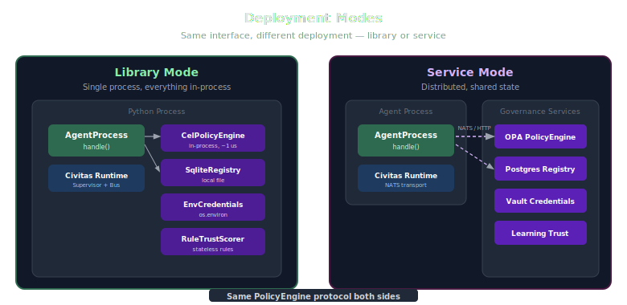

# The Full Stack

> How Civitas, Presidium, and external platforms fit together.


## Three Layers

| Layer | Concern | Projects |
|---|---|---|
| **Observe** | Watch agents, analyze behavior, alert, dashboard | Fiddler, Arize, Langfuse, Datadog |
| **Govern** | Control what agents can do, enforce policies, track identity | **Presidium** |
| **Run** | Keep agents alive, deliver messages, recover from crashes | **Civitas** |

Below these: agent frameworks (LangGraph, CrewAI, OpenAI Agents SDK) define how agents reason and act. Above them: enterprise systems (security, compliance, audit) consume governance signals.

## Why Three Layers, Not One?

Each layer has fundamentally different concerns:

**Runtime (Civitas)** cares about:
- Did the process crash? Restart it.
- Did the message arrive? Retry it.
- Is the transport alive? Reconnect it.
- Is the state persisted? Recover it.

**Governance (Presidium)** cares about:
- Is this agent authorized to do this? Check policy.
- Does this agent have the required trust level? Check registry.
- Is this LLM call within budget? Check gateway.
- Is this tool call safe? Check MCP gateway.

**Observability (External)** cares about:
- What happened? Show the trace.
- Is performance degrading? Alert.
- Is the agent hallucinating? Score it.
- Is compliance maintained? Report.

Combining all three into one project would create a 500K+ LOC monolith (see: Microsoft AGT). Separating them keeps each focused, testable, and replaceable.

## Integration Points

### Civitas → Presidium

Civitas provides extension points that Presidium hooks into:

| Civitas Extension | Presidium Usage |
|---|---|
| `Registry` | Extended with governance metadata (capabilities, trust, policies) |
| `Supervisor` | Policies become supervisor constraints |
| `MessageBus` | Action-level policy enforcement before delivery |
| `ModelProvider` protocol | LLM Gateway implements this |
| `ToolProvider` protocol | MCP Gateway implements this |
| `EvalLoop` | Extended with governance metrics |
| `ExportBackend` protocol | Fiddler/Arize/Langfuse exporters |
| OTEL spans | Enriched with governance context (policy decisions, trust scores) |

### Presidium → External Platforms

Presidium generates telemetry that external platforms consume:

| Signal | Format | Consumers |
|---|---|---|
| OTEL traces with governance spans | OpenTelemetry | Fiddler, Datadog, Jaeger |
| Eval scores | ExportBackend protocol | Fiddler, Arize, Langfuse |
| Policy decision logs | Structured JSON | SIEM, audit systems |
| Trust score history | Time-series | Prometheus, Grafana |
| Cost tracking | Metrics | FinOps tools, dashboards |

## Deployment Scenarios



Presidium components have two modes: library (in-process) and service (separate process, Civitas bus or HTTP). You can mix them. Start with everything in-process, then move individual components to service mode as your deployment grows. The application code doesn't change — only the topology config.

### Scenario 1: Developer Laptop (Library Mode)

Everything runs in-process. No infrastructure required beyond Python.

```
Single process, InProcessTransport
CEL policies from YAML files
InMemoryRegistry for agent records
EnvCredentialProvider for secrets
RuleBasedTrustScorer
Console audit output
```

```yaml
presidium:
  policy:
    type: cel
    rules_path: ./policies/
  registry:
    type: memory
  credentials:
    type: env
  trust:
    type: rule_based
  audit:
    type: console
```

### Scenario 2: Team Staging (Mixed)

Multi-process via ZMQ. Some components move to service mode; others stay in-process.

```
Multi-process, ZMQTransport
CEL policies (still in-process, loaded from shared path)
SQLite registry (file-based, shared across processes)
HashiCorp Vault for credentials
OTEL export to Langfuse or Datadog
```

```yaml
presidium:
  policy:
    type: cel
    rules_path: ./policies/
  registry:
    type: sqlite
    db_path: ./presidium.db
  credentials:
    type: vault
    url: https://vault.staging:8200
    token_env: VAULT_TOKEN
  trust:
    type: rule_based
  audit:
    type: otel
    endpoint: http://otel-collector:4317
```

### Scenario 3: Production (Service Mode)

Distributed via NATS. All components run as services. OPA or CEL depending on existing infrastructure.

```
Distributed, NATSTransport
OPA policy service (or CEL if no existing OPA)
Postgres-backed RegistryService
HashiCorp Vault
Full OTEL pipeline → Fiddler + Datadog
LearningTrustScorer service
SOC 2 audit trail
```

```yaml
presidium:
  policy:
    type: opa
    url: http://policy-service:8181
    # OR: type: cel with rules_path for teams without OPA
  registry:
    type: remote
    url: http://registry-service:8080
  credentials:
    type: vault
    url: https://vault.internal:8200
    auth: kubernetes
  trust:
    type: remote
    url: http://trust-service:8090
  audit:
    type: otel
    endpoint: http://otel-collector:4317
```

Same code, different topology config. That's the Civitas scaling ladder, extended with Presidium governance at every level.
