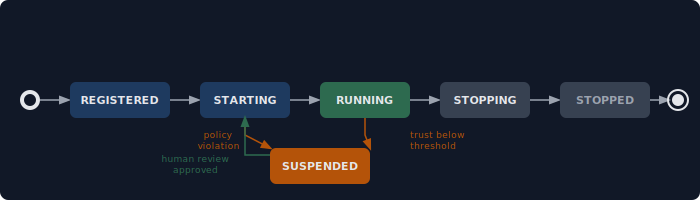

# Design: Agent Registry

> `presidium-registry` — Agent identity, capability registration, and trust tracking.

**Status:** Draft
**Package:** `presidium-registry`
**Milestone:** M2

## Problem Statement

In current agent systems, agents are anonymous. They have no persistent identity, no declared capabilities, no trust history. Any agent can access any resource, call any tool, use any LLM provider. There's no way to answer: "Which agents are running? What can they do? Should they be trusted?"

## Goals

1. Every agent has a persistent identity with declared capabilities
2. Agent capabilities determine what resources (LLMs, tools, APIs) are accessible
3. Trust scores track agent reliability over time and influence runtime behavior
4. Registry is the source of truth — agents must be registered before they can run

## Non-Goals

- User authentication (that's the platform's job, not the registry's)
- Agent-to-agent trust negotiation (potential future scope, not M2)
- Distributed registry consensus (single-process first, distributed later)

## Design

### Agent Record

```python
@dataclass
class AgentRecord:
    """Identity and governance metadata for a registered agent."""
    name: str                          # Unique identifier
    version: str                       # Semantic version
    owner: str                         # Human accountable for this agent
    capabilities: list[str]            # What this agent is allowed to do
    policies: list[str]                # Names of policies that apply
    trust_score: float = 1.0           # 0.0 to 1.0, starts at max
    state: AgentState = AgentState.REGISTERED
    metadata: dict[str, Any] = field(default_factory=dict)
    registered_at: datetime = field(default_factory=datetime.utcnow)
```

### Agent States



### Trust Score

Trust scores decay or grow based on runtime signals:

- **Positive signals:** Successful task completion, policy compliance, clean restart
- **Negative signals:** Policy violations, repeated crashes, tool misuse
- **Decay:** Trust decays slowly over time without positive signals (borrowed from AGT's trust decay concept)

Trust scores influence runtime behavior:
- Score > 0.7: Normal operation
- Score 0.4-0.7: Restricted capabilities (some tools/LLMs unavailable)
- Score < 0.4: Suspended — requires human review to reactivate

### Registry Protocol

```python
class AgentRegistry(Protocol):
    async def register(self, record: AgentRecord) -> None: ...
    async def unregister(self, name: str) -> None: ...
    async def lookup(self, name: str) -> AgentRecord | None: ...
    async def list_agents(self, filter: AgentFilter | None = None) -> list[AgentRecord]: ...
    async def update_state(self, name: str, state: AgentState) -> None: ...
    async def update_trust(self, name: str, delta: float, reason: str) -> None: ...
    async def get_capabilities(self, name: str) -> list[str]: ...
```

### Civitas Integration

The registry hooks into Civitas's agent lifecycle:

```python
class GovernedAgentProcess(AgentProcess):
    """AgentProcess with registry integration."""

    async def on_start(self) -> None:
        await self.registry.update_state(self.name, AgentState.RUNNING)
        await super().on_start()

    async def on_stop(self) -> None:
        await self.registry.update_state(self.name, AgentState.STOPPED)
        await super().on_stop()

    async def on_error(self, error: Exception) -> ErrorAction:
        await self.registry.update_trust(self.name, -0.05, str(error))
        return await super().on_error(error)
```

## Alternatives Considered

1. **Use Civitas's existing Registry directly** — Too simple. Civitas's registry maps names to process references. We need governance metadata.
2. **External identity system (DIDs like AGT)** — Over-engineered for M2. Could add DID support later as an optional backend.
3. **No registry — just policies** — Policies need something to attach to. Agent identity is foundational.

## Open Questions

- Should trust scores be configurable per-agent or global thresholds?
- Should the registry support agent groups/teams with shared capabilities?
- What's the persistence backend? In-memory first, SQLite later (matching Civitas's StateStore)?
- How does the registry interact with Civitas's topology YAML?
