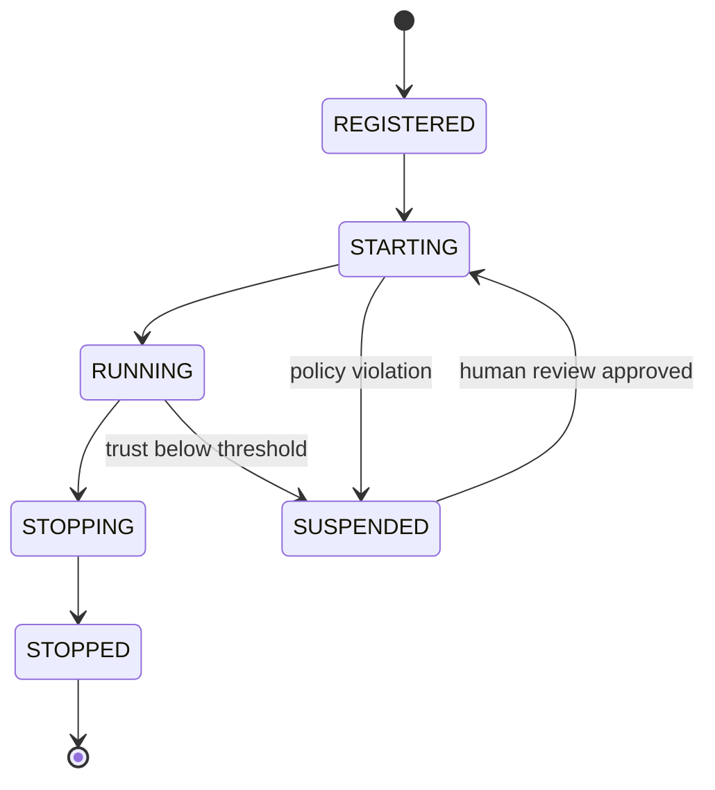

# Design: Agent Registry

> `presidium-registry` — Agent identity, grants, credential vault, and trust tracking.

**Status:** Draft
**Package:** `presidium-registry`
**Milestone:** M2

## Problem Statement

In current agent systems, agents are anonymous. They have no persistent identity, no declared authorization entitlements, no credential context, no trust history. Any agent can access any resource, call any tool, use any LLM provider. There's no way to answer: "Which agents are running? What are they authorized to access? Who is accountable for them? Should they be trusted?"

## Goals

1. Every agent has a persistent identity with declared authorization grants
2. Agent grants determine what resources (LLMs, tools, APIs) are accessible — enforced at the gateway level
3. Trust scores track agent reliability over time and influence runtime behavior
4. The registry is the source of truth — agents must be registered before they can run
5. Per-agent credential vault: OAuth tokens and API keys scoped to `(agent_id, user_id)`, with token exchange for user-delegated access

## Non-Goals

- User authentication (that's the platform's / enterprise IdP's job)
- Agent-to-agent trust negotiation (potential future scope, not M2)
- Distributed registry consensus (single-process first, distributed later)
- Implementing an Identity Provider (Presidium integrates with IdPs; does not issue identity tokens)

## Design

### Agent Record

```python
@dataclass
class AgentRecord:
    """Identity and governance metadata for a registered agent."""
    name: str                          # Unique identifier
    version: str                       # Semantic version
    owner: str                         # Human accountable for this agent
    grants: list[str]                  # Authorization entitlements (NOT Civitas routing capability tags)
                                       # e.g. ["tool:database:read", "llm:claude-sonnet", "data:customer_pii:read"]
    policies: list[str]                # Names of policies that apply
    trust_score: float = 1.0           # 0.0 to 1.0, starts at max
    state: AgentState = AgentState.REGISTERED
    metadata: dict[str, Any] = field(default_factory=dict)
    registered_at: datetime = field(default_factory=datetime.utcnow)
```

**Note**: `grants` are Presidium authorization entitlements — what an agent is *permitted to access*. They are distinct from Civitas `AgentProcess.capabilities`, which are operational routing tags (what an agent *can handle technically*). Do not conflate these.

### Agent States



### Trust Score

Trust scores decay or grow based on runtime signals:

- **Positive signals:** Successful task completion, policy compliance, clean restart
- **Negative signals:** Policy violations, repeated crashes, tool misuse
- **Decay:** Trust decays slowly over time without positive signals

Trust scores influence runtime behavior:
- Score > 0.7: Normal operation
- Score 0.4–0.7: Restricted grants (some tools/LLMs unavailable)
- Score < 0.4: Suspended — requires human review to reactivate

### Registry Protocol

```python
class AgentRegistry(Protocol):
    async def register(self, record: AgentRecord) -> None: ...
    async def unregister(self, name: str) -> None: ...
    async def lookup(self, name: str) -> AgentRecord | None: ...
    async def list_agents(self, filter: AgentFilter | None = None) -> list[AgentRecord]: ...
    async def update_state(self, name: str, state: AgentState) -> None: ...
    async def update_trust(self, name: str, delta: float, reason: str) -> None: ...
    async def get_grants(self, name: str) -> list[str]: ...
```

### Credential Vault Protocol

```python
class CredentialVault(Protocol):
    async def get_agent_token(self, agent_name: str) -> str: ...
    async def get_user_delegated_token(self, agent_name: str, user_id: str, scope: str) -> str: ...
    async def store_token(self, agent_name: str, user_id: str, token: OAuthToken) -> None: ...
    async def exchange_obo(self, user_token: str, agent_name: str, target_scope: str) -> str: ...
```

Credential vault stores OAuth tokens and API keys scoped per `(agent_id, user_id)` tuple. Encrypted at rest via KMS. Supports:

- **Client credentials** — autonomous agent-to-service access (no user in the loop)
- **OBO (On-Behalf-Of, RFC 8693)** — agent acts for a specific user; downstream sees both agent and user identity
- **XAA / ID-JAG** — enterprise IdP brokers delegated access; no per-user consent fatigue after initial setup
- **MCP OAuth 2.1** — token per MCP server endpoint with Resource Indicators (RFC 8707); prevents token mis-redemption across servers

### Civitas Integration: RegistryListener

The registry integrates with Civitas via the `RegistryListener` hook (integration point 1). Civitas fires this callback on every agent register/deregister event; Presidium subscribes to populate its persistent `AgentRecord`.

```python
class PresidiumRegistryListener:
    """Subscribes to Civitas RegistryListener; populates AgentRecord on agent start/stop."""

    async def on_register(self, name: str, capability_tags: list[str]) -> None:
        record = await self._registry.lookup(name)
        if record:
            await self._registry.update_state(name, AgentState.RUNNING)
        # capability_tags are Civitas routing tags — do not store as grants

    async def on_deregister(self, name: str) -> None:
        await self._registry.update_state(name, AgentState.STOPPED)
```

This is the correct integration pattern. Presidium does **not** subclass `AgentProcess` (that would couple the two layers). Instead, it subscribes to Civitas lifecycle events from the outside.

### Credential Context Injection

At agent startup, Presidium populates the `credentials` context dict passed to each agent (Civitas integration point 7):

```python
{
    "agent_token": "<short-lived JWT for this agent>",
    "vault_endpoint": "https://vault.internal/v1/",
    "grants": ["tool:database:read", "llm:claude-sonnet"],
    "client_id": "<agent's OAuth client ID>",
}
```

The agent uses this context to authenticate to tools and LLMs. The gateways (`GovernedModelProvider`, `GovernedToolProvider`) validate grants against policy before any call proceeds.

## Alternatives Considered

1. **Use Civitas's routing registry directly** — Too simple. Civitas's registry maps names to process references. We need persistent governance metadata, grants, trust scores, and credential vault.
2. **External identity system (DIDs like AGT)** — Over-engineered for M2. Could add DID support later as an optional backend.
3. **No registry — just policies** — Policies need something to attach to. Agent identity and grants are foundational to every other Presidium concern.
4. **Subclass `AgentProcess`** — Creates tight coupling between Civitas and Presidium. The `RegistryListener` hook achieves the same result without coupling.

## Open Questions

- Should trust score thresholds (0.7 / 0.4) be configurable per-agent or global?
- Should the registry support agent groups/teams with shared grants?
- What's the persistence backend? In-memory first, then Postgres (matching Civitas's `StateStore`)?
- How does the registry interact with Civitas topology YAML? Proposal: `governance:` block extension in `presidium-sdk`.
