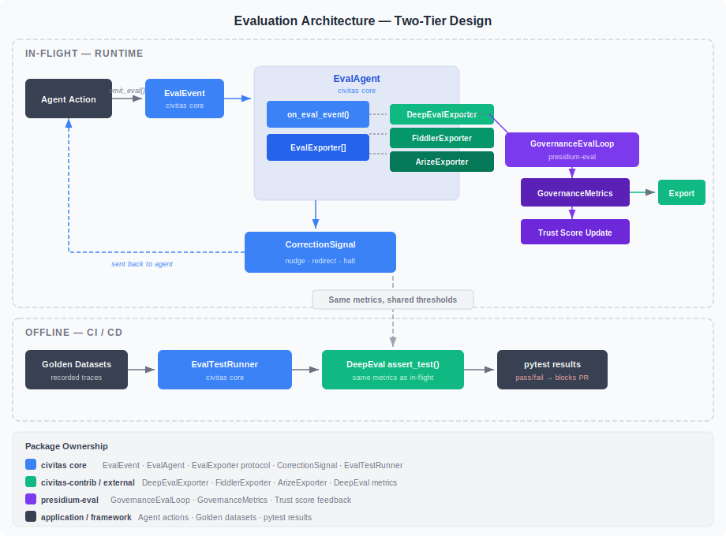
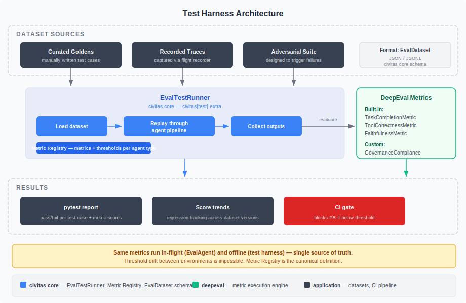
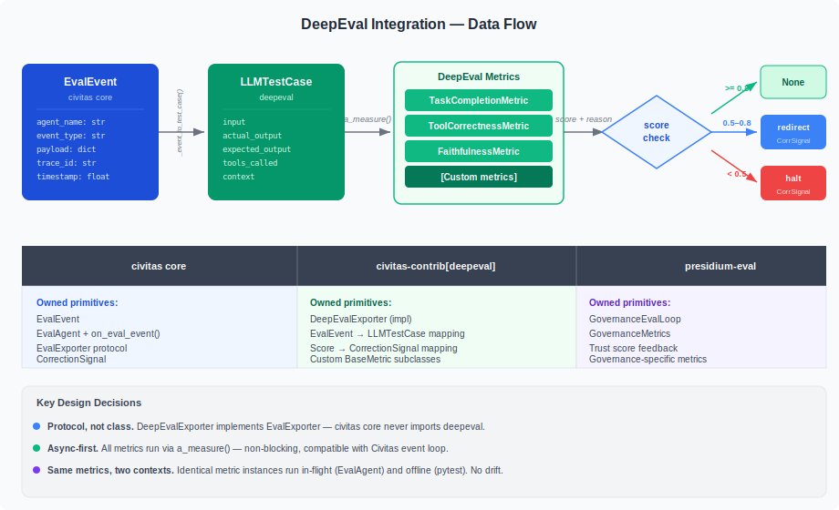

# Design: Eval Framework

> `presidium-eval` — Governance-aware evaluation, test harness, and external platform integration.

**Status:** Draft (revised)
**Package:** `presidium-eval`
**Milestone:** M4
**Depends on:** `civitas` (EvalLoop, EvalAgent, EvalExporter), `presidium-registry` (trust scores)

---

## Problem Statement

Agents in production need two kinds of evaluation:

1. **Output quality** — Did the agent produce a correct, useful result? (Task completion, tool selection accuracy, faithfulness to context.)
2. **Governance compliance** — Did the agent stay within policy? Is its trust score trending correctly? Did it use only authorized tools?

Existing eval tools (Fiddler, Arize, Langfuse) address output quality as post-hoc dashboards. They don't evaluate governance compliance, they don't enforce thresholds at runtime, and they don't provide an offline regression harness that uses the same metrics as production.

Civitas provides the runtime primitives (`EvalAgent`, `EvalExporter`, `CorrectionSignal`) but defines no metrics, no test harness, and no governance integration. There is a gap between "we can observe" and "we can systematically evaluate and regress."

Three concrete gaps:

**Gap 1 — No in-flight quality scoring.** An agent that drifts from its task or selects wrong tools generates no signal until a human reviews the output. The EvalAgent hook exists but ships with no metric implementations.

**Gap 2 — No offline regression harness.** When you change an agent's prompt, model, or tool set, there is no way to run a suite of recorded tasks and assert that quality didn't regress. This is the equivalent of shipping code without running the test suite.

**Gap 3 — No governance-quality feedback loop.** Governance metrics (policy compliance, grant utilization, budget consumption) and quality metrics (task completion, tool correctness) are evaluated by separate systems with no shared vocabulary. Trust scores cannot incorporate quality signals, and quality evaluations cannot incorporate governance context.

---

## Goals

1. Define a two-tier evaluation architecture: in-flight (runtime) and offline (CI/CD)
2. Introduce a test harness for offline agent regression testing with golden datasets
3. Integrate DeepEval as the recommended (not required) eval backend via `civitas-contrib[deepeval]`
4. Define governance-specific evaluation metrics that extend Civitas's EvalLoop
5. Close the feedback loop: eval scores → trust score adjustments → autonomy changes
6. Export governance metrics to external platforms (Fiddler, Arize, Langfuse, Prometheus)

## Non-Goals

- Replace Fiddler/Arize — Presidium generates governance metrics, they dashboard them
- Content safety (hallucination detection, toxicity) — that's guardrails, not structural governance
- Real-time policy enforcement — that's `presidium-policy`
- Mandating DeepEval — it's the recommended backend, but the architecture is backend-agnostic via `EvalExporter`

---

## Architecture



### Two-Tier Design

Evaluation runs at two points in the agent lifecycle:

| Tier | When | Where | Latency budget | Purpose |
|---|---|---|---|---|
| **In-flight** | Every agent action, in real time | Inside the Civitas supervision tree (`EvalAgent`) | < 500ms for deterministic; async for LLM-as-Judge | Catch violations as they happen; emit CorrectionSignals; feed trust scores |
| **Offline** | CI/CD, pre-merge, scheduled | pytest suite (`EvalTestRunner`) | Unbounded | Regression testing; golden dataset validation; threshold assertion |

The same metric instances run in both tiers. This is a non-negotiable design constraint — if in-flight and offline use different metrics, thresholds will drift and regressions will be invisible.

### Three Layers of Evaluation

| Layer | Owns | Metrics | Package |
|---|---|---|---|
| **Agent quality** | Did the agent produce a good result? | TaskCompletion, ToolCorrectness, Faithfulness, custom | `civitas-contrib[deepeval]` or any `EvalExporter` |
| **Governance compliance** | Did the agent follow policy? | PolicyCompliance, GrantUtilization, BudgetAdherence, DriftScore | `presidium-eval` |
| **Trust feedback** | Should the agent's autonomy change? | Composite of quality + governance scores | `presidium-eval` → `presidium-registry` |

Quality and governance are distinct evaluation streams (as established in the [Architecture Overview](../architecture/overview.md)):

- **EvalLoop (Civitas):** Did the agent produce a good output? Internal quality signal.
- **presidium-eval (Presidium):** Did the agent comply with policy? External accountability signal.

The trust feedback layer combines both. A high-quality agent that violates policy should not earn trust. A policy-compliant agent that produces bad outputs should not retain trust.

---

## Design

### In-Flight Evaluation

The `EvalAgent` is a supervised process that sits alongside application agents in the supervision tree. It receives `EvalEvent` messages emitted by agents via `self.emit_eval()`, runs metrics via its `EvalExporter` chain, and returns `CorrectionSignal` when thresholds are breached.

```python
# Civitas core — already shipped
class EvalAgent(AgentProcess):
    async def on_eval_event(self, event: EvalEvent) -> CorrectionSignal | None:
        """Override point. Return a CorrectionSignal to intervene."""
        return None
```

Presidium extends this with governance context:

```python
# presidium-eval — new
class GovernanceEvalAgent(EvalAgent):
    """Extends EvalAgent with governance metric collection and trust feedback."""

    def __init__(
        self,
        name: str,
        registry: AgentRegistry,
        policy_engine: PolicyEngine,
        metrics: list[GovernanceMetric],
        exporters: list[EvalExporter] | None = None,
        **kwargs: Any,
    ) -> None:
        super().__init__(name, exporters=exporters, **kwargs)
        self._registry = registry
        self._policy_engine = policy_engine
        self._metrics = metrics

    async def on_eval_event(self, event: EvalEvent) -> CorrectionSignal | None:
        # 1. Run governance metrics
        governance_scores = await self._evaluate_governance(event)

        # 2. Collect quality scores from exporters (DeepEval, etc.)
        quality_scores = self._collect_exporter_scores()

        # 3. Compute composite score
        composite = self._compute_composite(governance_scores, quality_scores)

        # 4. Update trust score
        await self._update_trust(event.agent_name, composite)

        # 5. Return CorrectionSignal if warranted
        return self._score_to_signal(composite, governance_scores, quality_scores)

    def _score_to_signal(
        self, composite: float, governance: dict, quality: dict
    ) -> CorrectionSignal | None:
        if composite >= 0.8:
            return None
        if composite < 0.4:
            failed = [k for k, v in {**governance, **quality}.items() if v < 0.5]
            return CorrectionSignal(
                severity="halt",
                reason=f"Critical eval failure: {', '.join(failed)}",
                payload={"governance": governance, "quality": quality},
            )
        failed = [k for k, v in {**governance, **quality}.items() if v < 0.7]
        return CorrectionSignal(
            severity="redirect",
            reason=f"Below threshold: {', '.join(failed)}",
            payload={"governance": governance, "quality": quality},
        )
```

#### CorrectionSignal Severity Mapping

| Composite score | Severity | Effect on agent | Trust delta |
|---|---|---|---|
| ≥ 0.8 | None | No correction | +0.02 per window |
| 0.4 – 0.8 | `redirect` | Agent receives correction, should change approach | -0.05 |
| < 0.4 | `halt` | Agent's message loop is stopped; human review required | -0.2 |

These thresholds are configurable per agent via the Metric Registry (see below).

### Governance Metrics

```python
@dataclass
class GovernanceMetrics:
    """Metrics computed per agent per evaluation window."""
    policy_compliance_rate: float       # % of actions that passed policy check
    denial_count: int                   # Number of DENY decisions this window
    approval_pending_count: int         # Actions waiting for REQUIRE_APPROVAL
    trust_score_delta: float            # Change in trust score this window
    tool_usage_authorized: float        # % of tool calls to granted tools
    llm_budget_utilization: float       # % of LLM token/cost budget consumed
    restart_count: int                  # Number of supervisor restarts
    mean_action_latency_ms: float       # Average policy evaluation latency
    drift_score: float                  # Deviation from declared intent (0.0 = on track)
    grant_violation_count: int          # Attempts to access ungrated resources
```

Each field maps to a `GovernanceMetric` protocol implementation:

```python
class GovernanceMetric(Protocol):
    """Single governance metric computed from policy engine state."""
    name: str
    threshold: float

    async def evaluate(
        self,
        agent_name: str,
        policy_engine: PolicyEngine,
        registry: AgentRegistry,
        window: TimeWindow,
    ) -> float: ...
```

### Metric Registry

The Metric Registry is the canonical definition of which metrics run for which agent types, with what thresholds. It is the single source of truth for both in-flight and offline evaluation.

```python
@dataclass
class MetricConfig:
    """Configuration for a single metric applied to an agent pattern."""
    metric_name: str
    threshold: float
    severity_on_breach: Literal["nudge", "redirect", "halt"]
    in_flight: bool = True      # Run in EvalAgent?
    offline: bool = True        # Run in test harness?

@dataclass
class MetricRegistryEntry:
    """Metrics configuration for a set of agents."""
    agent_pattern: str          # Glob pattern, e.g. "coder-*"
    metrics: list[MetricConfig]

class MetricRegistry:
    """Loads metric configurations and resolves which metrics apply to an agent."""

    def __init__(self, entries: list[MetricRegistryEntry]) -> None: ...
    def get_metrics(self, agent_name: str, context: str = "in_flight") -> list[MetricConfig]: ...
```

YAML configuration:

```yaml
# eval.yaml — loaded by MetricRegistry
eval:
  metrics:
    - agents: "*"
      metrics:
        - name: policy_compliance
          threshold: 0.95
          severity: redirect
        - name: budget_utilization
          threshold: 0.9
          severity: halt

    - agents: "coder-*"
      metrics:
        - name: task_completion
          threshold: 0.7
          severity: redirect
        - name: tool_correctness
          threshold: 0.8
          severity: redirect
        - name: scope_drift
          threshold: 0.9
          severity: halt
          in_flight: true
          offline: true
```

### Export Backends

```python
class GovernanceExporter(Protocol):
    """Exports governance metrics to external platforms."""

    async def export(
        self,
        agent_name: str,
        metrics: GovernanceMetrics,
        window: TimeWindow,
    ) -> None: ...
```

Planned implementations:

| Exporter | Package | Destination |
|---|---|---|
| `FiddlerExporter` | `presidium-eval` | Fiddler AI platform |
| `ArizeExporter` | `presidium-eval` | Arize Phoenix |
| `LangfuseExporter` | `presidium-eval` | Langfuse |
| `PrometheusExporter` | `presidium-eval` | Prometheus (time-series) |
| `ConsoleExporter` | `presidium-eval` | stdout (development) |

These are distinct from Civitas's `EvalExporter` (which exports `EvalEvent`). `GovernanceExporter` exports aggregated `GovernanceMetrics` — a higher-level summary.

### Trust Score Feedback Loop

```
Agent acts
  → Policy evaluates (presidium-policy)
  → OTEL span emitted (civitas)
  → EvalAgent receives EvalEvent (civitas)
    → GovernanceEvalAgent.on_eval_event() (presidium-eval)
      → Governance metrics computed
      → Quality metrics computed (via DeepEvalExporter or others)
      → Composite score
      → Trust score adjustment (presidium-registry)
      → CorrectionSignal sent to agent (civitas)
  → GovernanceExporter.export() (presidium-eval)
    → Fiddler / Arize / Langfuse / Prometheus
  → Alert if threshold breached
```

The feedback loop is closed: eval results change trust scores, trust scores change autonomy levels (via trust-gated policy thresholds in `presidium-policy`), autonomy levels change what actions the agent can take without approval.

---

## Test Harness



### Problem

There is no way to regression-test agent behavior. When you change an agent's prompt, model, or tool set, you cannot run a suite of recorded tasks and assert that quality didn't regress. This is the agent equivalent of shipping code without running `pytest`.

### Design

The test harness lives in **civitas core** as a `civitas[test]` extra. It is not governance-specific — any Civitas agent can use it. Presidium adds governance metrics on top.

#### EvalDataset

```python
@dataclass
class EvalTestCase:
    """A single recorded agent interaction for offline evaluation."""
    input: dict[str, Any]                        # Task/message sent to agent
    expected_output: dict[str, Any] | None       # Known-correct output (optional)
    expected_tools: list[str] | None             # Tools that should be used
    context: list[str] | None                    # Retrieval context provided
    metadata: dict[str, Any] | None              # Arbitrary annotations
    tags: list[str] | None                       # For filtering: ["regression", "adversarial"]

@dataclass
class EvalDataset:
    """A collection of test cases for offline agent evaluation."""
    name: str
    version: str
    test_cases: list[EvalTestCase]

    @classmethod
    def from_json(cls, path: Path) -> EvalDataset: ...

    @classmethod
    def from_jsonl(cls, path: Path) -> EvalDataset: ...

    def save(self, path: Path) -> None: ...
```

#### EvalTestRunner

```python
class EvalTestRunner:
    """Runs an agent pipeline against an EvalDataset and collects metric scores."""

    def __init__(
        self,
        agent_factory: Callable[[], AgentProcess],
        metric_registry: MetricRegistry,
        exporters: list[EvalExporter] | None = None,
    ) -> None: ...

    async def run(self, dataset: EvalDataset) -> EvalReport: ...

@dataclass
class EvalReport:
    """Results of running an EvalDataset through an agent pipeline."""
    dataset_name: str
    dataset_version: str
    results: list[EvalTestResult]
    aggregate_scores: dict[str, float]   # metric_name → mean score
    passed: bool                          # All metrics above threshold?
    duration_seconds: float

@dataclass
class EvalTestResult:
    """Result of a single test case."""
    test_case: EvalTestCase
    actual_output: dict[str, Any]
    tools_called: list[str]
    scores: dict[str, float]              # metric_name → score
    passed: bool
    reasons: dict[str, str]               # metric_name → reason
```

#### pytest Integration

```python
# tests/evals/test_my_agent.py
import pytest
from civitas.testing import EvalDataset, EvalTestRunner

dataset = EvalDataset.from_json("datasets/my_agent_v1.json")

@pytest.fixture
def runner():
    return EvalTestRunner(
        agent_factory=lambda: MyAgent("test_agent"),
        metric_registry=MetricRegistry.from_yaml("eval.yaml"),
    )

@pytest.mark.parametrize("test_case", dataset.test_cases, ids=lambda tc: tc.metadata.get("id", ""))
async def test_agent_eval(runner, test_case):
    result = await runner.run_single(test_case)
    assert result.passed, f"Failed metrics: {[k for k, v in result.scores.items() if v < runner.threshold(k)]}"
```

Run:

```bash
# Standard pytest
uv run pytest tests/evals/ -v

# With DeepEval dashboard (if civitas-contrib[deepeval] installed)
deepeval test run tests/evals/
```

#### Dataset Sources

| Source | Description | Automation |
|---|---|---|
| **Curated goldens** | Manually written test cases with known-correct outputs | Manual |
| **Recorded traces** | Captured from production via flight recorder | Automatic (opt-in) |
| **Adversarial suite** | Designed to trigger drift, policy violations, edge cases | Manual |

The flight recorder is a Civitas `AuditSink` implementation that writes `EvalTestCase` records for every agent interaction. It captures input, output, tools called, and metadata. Teams opt in per agent via topology config:

```yaml
audit:
  sinks:
    - type: eval_recorder
      config:
        output_dir: datasets/recorded/
        format: jsonl
        agents: ["coder-*", "reviewer-*"]   # record only these agents
```

---

## DeepEval Integration



DeepEval is the **recommended** eval backend. It is not required — the architecture is backend-agnostic via `EvalExporter`. But DeepEval is uniquely suited because it provides both in-flight metrics (via `a_measure()`) and an offline test harness (via `assert_test()` + pytest).

For the full integration design, see the companion doc: [DeepEval Integration](deepeval-integration.md).

### Summary

| Aspect | Implementation |
|---|---|
| Package | `civitas-contrib[deepeval]` |
| Integration point | `EvalExporter` protocol (civitas core) |
| Key class | `DeepEvalExporter` — bridges `EvalEvent` → `LLMTestCase` → metrics |
| Built-in metrics used | `TaskCompletionMetric`, `ToolCorrectnessMetric`, `FaithfulnessMetric`, `PlanAdherenceMetric` |
| Custom metrics | `GovernanceComplianceMetric`, `ScopeDriftMetric` (extend `BaseMetric`) |
| Async support | All metrics run via `a_measure()` — non-blocking |
| Offline harness | `deepeval test run` wraps pytest; uses same metrics as in-flight |

### Why DeepEval Over Alternatives

| Alternative | Why not primary |
|---|---|
| Fiddler | Observability platform — dashboards, not metrics engine. Complementary, not replacement |
| Arize Phoenix | Same — observability, not eval harness |
| Langfuse | Same — tracing + analytics, no pytest integration |
| Ragas | RAG-focused. Useful for retrieval agents, not general-purpose agent eval |
| Custom metrics only | Misses the ecosystem: 50+ built-in metrics, dataset management, regression tracking |

DeepEval is the only option that provides a metrics engine, custom metric extensibility, and a pytest-integrated test harness in a single package.

---

## Civitas Core Changes Required

The test harness (`EvalTestRunner`, `EvalDataset`, `EvalTestCase`) lives in civitas core as a `civitas[test]` extra. This requires adding modules to `python-civitas`:

| Module | Purpose | New? |
|---|---|---|
| `civitas/testing/__init__.py` | Public surface for test harness | New |
| `civitas/testing/dataset.py` | `EvalDataset`, `EvalTestCase` | New |
| `civitas/testing/runner.py` | `EvalTestRunner`, `EvalReport`, `EvalTestResult` | New |
| `civitas/testing/recorder.py` | Flight recorder `AuditSink` implementation | New |

The `civitas[test]` extra adds `deepeval` as an optional dependency (for `deepeval test run` integration). The test harness itself works without DeepEval — it uses `EvalExporter` protocol, which any backend can implement.

No changes to existing civitas modules. The existing `EvalAgent`, `EvalExporter`, `EvalEvent`, and `CorrectionSignal` are sufficient.

---

## Open Questions

- **Evaluation window:** What's the default window for governance metrics? 30s is too noisy. 5m is too slow for halt signals. Proposal: configurable, default 60s.
- **Auto vs. manual trust adjustment:** Should eval automatically adjust trust scores, or just report? Proposal: automatic by default, with an `auto_trust_feedback: bool` config knob.
- **Infrequent agents:** How do we evaluate agents that run once a day? Window-based metrics don't apply. Proposal: per-invocation mode (evaluate after each task, not per window).
- **Flight recorder privacy:** Recorded traces may contain sensitive data. Should the recorder support field-level redaction? Proposal: yes, configurable via `redact_fields: ["payload.pii", "payload.credentials"]`.
- **Metric Registry location:** Should `eval.yaml` be a standalone file, a section in `topology.yaml`, or part of the agent's constitution? Proposal: standalone file, referenced from topology.yaml via `eval: ./eval.yaml`.
- **DeepEval Confident AI:** Should the integration support DeepEval's optional cloud component for dataset management and dashboards? Proposal: support but don't require — local-first by default.
