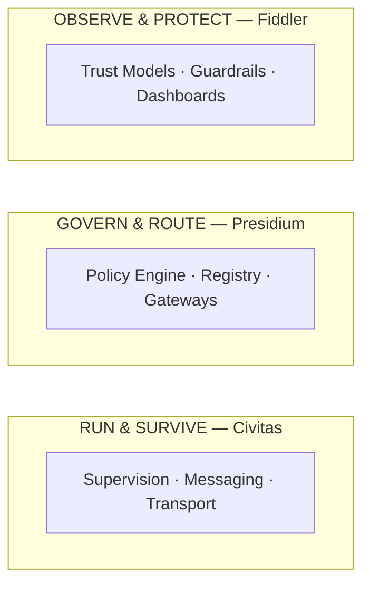
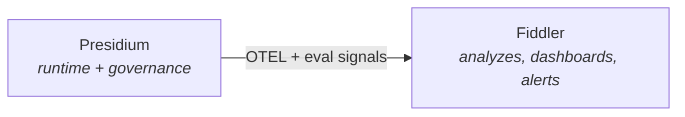

# Fiddler Relationship Analysis

> How Presidium relates to Fiddler.ai — complement, not competitor.

## Context

Fiddler AI ($100M total funding, Series C Jan 2026) positions itself as "The Control Plane for AI Agents." This document analyzes whether Presidium competes with or complements Fiddler.

## Fiddler's Product

| Capability | Description | Presidium Overlap? |
|---|---|---|
| **Agentic Observability** | Hierarchical tracing (app → session → agent → trace → span) | No — Presidium generates OTEL spans, Fiddler visualizes them |
| **Trust Models** | Purpose-built scoring models for hallucination, toxicity, PII (<100ms) | No — content safety, not structural governance |
| **Guardrails** | Real-time input/output moderation | Minimal — Fiddler guards content, Presidium guards capabilities |
| **LLM Monitoring** | Drift detection, performance degradation, cost tracking | Minimal — Presidium tracks cost at gateway level |
| **Compliance/Audit** | SOC 2 Type 2, HIPAA, audit trails | Adjacent — different audit signals |
| **Agent Runtime** | None | **Presidium's domain** |
| **Agent Registry** | None | **Presidium's domain** |
| **Message Routing** | None | **Presidium's domain** |
| **Policy Engine** | Emerging ("enforceable policy" in Series C pitch) | **Watch area** |

## Where They Sit in the Stack

**Fiddler sits above Presidium.** It consumes telemetry from whatever runs below.

## The Verdict: Complementary

| Dimension | Fiddler | Presidium |
|---|---|---|
| Core value | "Can I trust my agents?" | "Can I run governed agents?" |
| Buyer | Trust & Safety, Security teams | Platform Engineering, Agent developers |
| When | Post-deployment (monitor + protect) | Pre- and during deployment (build + operate) |
| Deployment | SaaS platform | Runtime library |
| Framework dependency | Agnostic (observes any agent) | Runtime-specific (agents run on Civitas) |

### The Natural Pipeline

Presidium is a **data source** for Fiddler. The `presidium-eval` package includes a `FiddlerExporter` that sends governance metrics to Fiddler for visualization.

## Watch Areas

1. **"Control Plane" branding overlap** — Fiddler is investing in this narrative. Presidium should position as "governed runtime," not "control plane."
2. **Policy enforcement direction** — Fiddler's Series C mentions "enforceable policy." Monitor their roadmap. Fiddler's policies will likely be content-focused (guardrails), not structural (capabilities).
3. **Agent lifecycle expansion** — Fiddler may expand downward in the stack over time. But building a runtime would be a fundamentally different engineering and business proposition.

## Things Presidium Does That Fiddler Almost Certainly Won't

- Run agents (supervision trees, restart strategies)
- Manage agent lifecycle (spawn, scale, crash recovery)
- Handle transport (in-process → multi-process → distributed)
- Provide message passing (mailboxes, named routing, backpressure)

Fiddler is an analytics/safety SaaS. Building a runtime would be outside their core competency and business model.

## Positioning Recommendation

- Position Presidium as **"governed runtime"** not **"control plane"**
- Highlight Fiddler integration as a first-class feature
- Make `FiddlerExporter` one of the first eval exporters built
- Emphasize that Presidium + Fiddler > either alone
