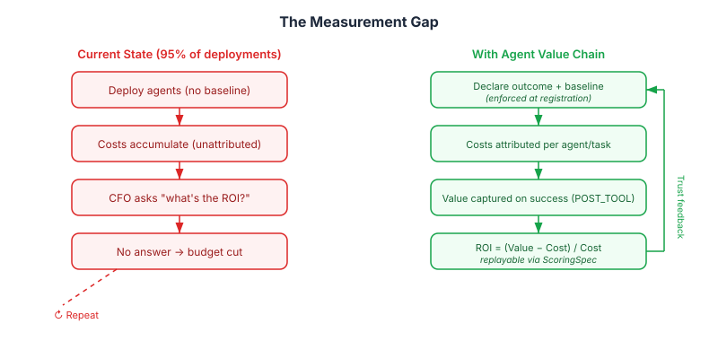
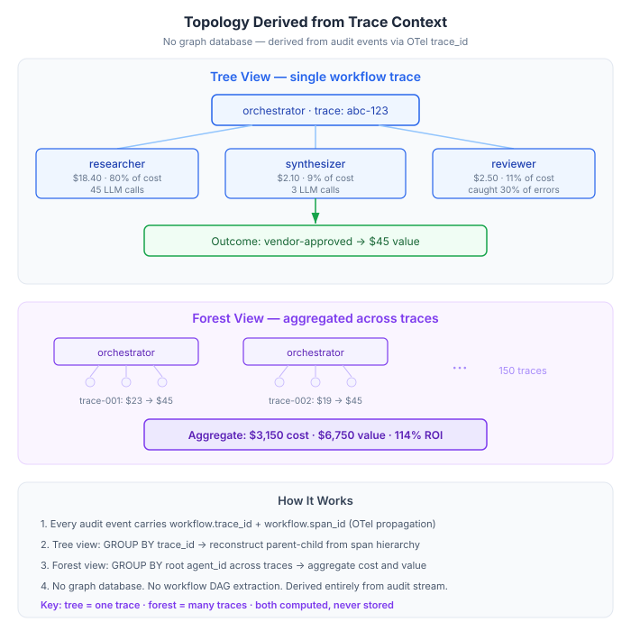
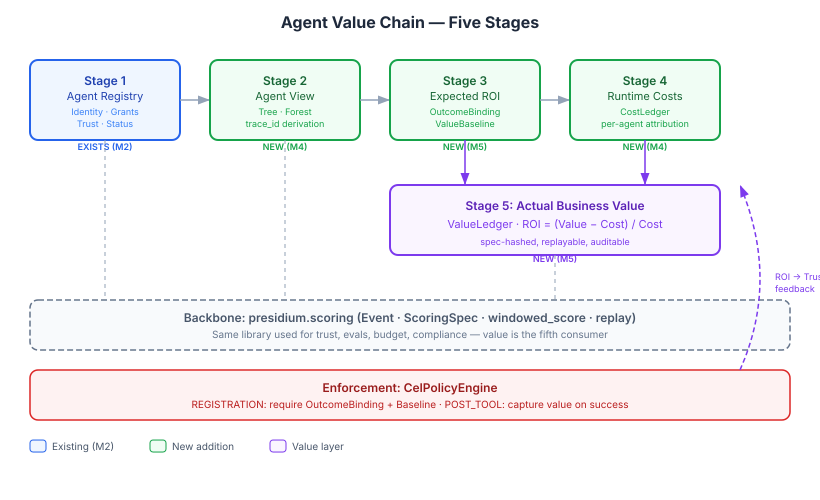
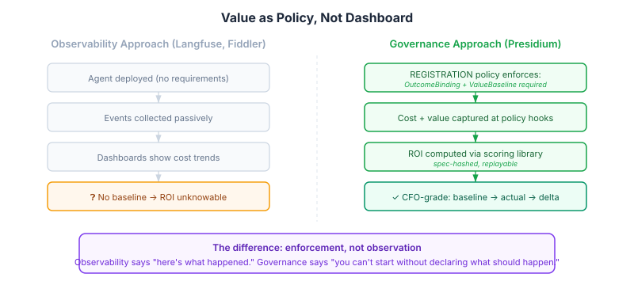
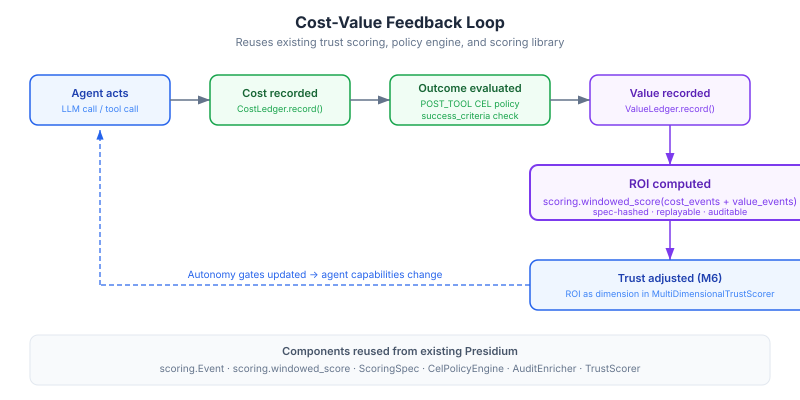

# RFC-003: Agent Value Chain — From Registry to Business Value

**Status:** Draft
**Author:** Jeryn Mathew
**Created:** 2026-06-16
**Milestone:** M4 (foundation), M5 (outcomes), M6 (feedback loop)

---

## Summary

This RFC proposes extending Presidium with an **Agent Value Chain** — a five-stage pipeline that connects agent identity to measurable business impact:

**Agent Registry → Agent View (topology) → Expected ROI → Runtime Costs → Actual Business Value**

The core insight: **value is not a metric to compute — it is a policy to enforce.** Every observability vendor measures cost after the fact. Presidium is the only layer that can *require* value declaration before an agent runs.

---

## Motivation

### The Measurement Crisis

The AI agent industry has a measurement problem:

- **95%** of AI pilots deliver zero measurable P&L impact (MIT 2026)
- **Only 25%** of AI initiatives deliver expected ROI (IBM CEO Study 2026)
- **Only 29%** of organizations can measure ROI confidently
- **61%** deploy AI with no baseline measurement beforehand
- **42%** of companies abandoned most AI projects in 2025 (S&P Global)
- Typical AI payback: **2–4 years**, not the 7–12 months enterprises expect
- Vendor ROI claims are typically **2–4× the realized number**

The root cause is structural, not technical: nobody requires measurement infrastructure before deployment.

<p align="center">

</p>

### Why This Matters for Presidium

Presidium already governs *how* agents behave (policy, grants, trust). The missing dimension is *whether agents are worth running*. Trust says an agent behaves well. Value says an agent delivers business impact. Both are governance decisions — not dashboard features.

Presidium sits at the only junction that sees both:
- **Pre-execution intent** — what the agent is declared to do (outcome binding)
- **Post-execution reality** — what actually happened (cost + value events)

No observability platform can enforce baseline declaration. No FinOps tool can tie cost to business outcomes through a governance policy. Presidium can.

---

## The Problem-Solution Space

### Problem 1: "We deployed 50 agents. What's the ROI?"

**Current state:** Organizations deploy agents, track token costs in Langfuse, and have no way to connect those costs to business outcomes. CFO asks for ROI → engineering says "productivity improved" → CFO says "show me the P&L impact" → silence.

**Solution:** `OutcomeBinding` declares what each agent (or agent workflow) is supposed to produce. `ValueBaseline` captures the "before" number. `CostLedger` captures runtime spend. `ValueLedger` captures successful outcomes. ROI is computed by the scoring library — pinned, replayable, auditable.

```
$ presidium roi show --agent researcher --window 90d

Agent: presidium://acme.com/prod/researcher
Outcome: vendor-approval (declared 2026-03-15)
Baseline: $45/approval (manual, N=50, Q4 2025)

  Period          Cost        Value    Approvals   Cost/Unit    ROI
  ─────────────   ─────────   ──────   ─────────   ─────────   ─────
  2026-Q1         $2,340      $8,100   180         $13.00      246%
  2026-Q2 (MTD)   $1,890      $6,750   150         $12.60      257%

  Spec: sha256:a4f2c8... (pinned, replayable)
```

### Problem 2: "Which agents in this workflow are pulling their weight?"

**Current state:** A multi-agent workflow completes tasks but it's unclear which agents contribute value vs. which are overhead. A research agent, synthesis agent, and review agent collaborate — the research agent makes 80% of the LLM calls but the review agent catches 30% of errors.

**Solution:** `workflow.trace_id` propagated through audit events gives the tree view. Cost attribution per agent within the trace shows the spend distribution. Value capture at the workflow outcome ties back to the trace. The "forest" view aggregates across traces by root agent.

<p align="center">

</p>

### Problem 3: "Agent costs spiked 300% this month — why?"

**Current state:** Token costs visible in Langfuse but not attributed to business outcomes. A research agent tripled its cost because it handles 3× more vendor approvals — that's a feature, not a bug. But without outcome binding, the cost spike looks like waste.

**Solution:** `CostLedger` attributes cost per agent, per task, per tenant, per workflow trace. When paired with `ValueLedger`, the cost spike maps to a proportional value increase → ROI stays stable. Without value context, the same data triggers a false alarm.

### Problem 4: "How do we justify the AI investment to the board?"

**Current state:** Engineering builds agents. Finance asks for returns. The two worlds speak different languages (tokens vs. dollars, latency vs. cycle time).

**Solution:** `ValueBaseline` speaks finance's language — declared in dollars, measured against a pre-pilot "before" number, with a locked `spec_hash` for tamper-evidence. The ROI computation reuses `presidium.scoring.windowed_score` — the same engine that computes trust scores, applied to value. Deterministic replay means the CFO's auditor can reproduce the number.

---

## Architecture

### Five-Stage Pipeline

<p align="center">

</p>

### Presidium's Unique Position

<p align="center">

</p>

---

## Data Model

### New Types (additions to Presidium)

```python
# presidium.value.model

@dataclass(frozen=True)
class OutcomeBinding:
    """The contract: 'this agent's job is to produce outcome X.'

    Declared at registration or workflow start. Audit-pinned via spec_hash.
    Required by REGISTRATION policy in production environments.
    """
    outcome_id: str                    # "vendor-approved", "incident-resolved"
    agent_id: str                      # presidium:// URI of the chain root
    workflow_trace_id: str | None      # OTel trace ID; None for static bindings
    declared_at: datetime
    declared_value_usd: float | None   # expected $ per success
    success_criteria: str              # CEL expression evaluated against POST_TOOL result
    owner: str                         # human sponsor (matches AgentRecord.owner)


@dataclass(frozen=True)
class ValueBaseline:
    """Pre-pilot 'before' number. Spec-hashed for tamper-evidence.

    The minimum viable CFO artifact: what did this process cost before
    the agent existed? How was that measured?
    """
    outcome_id: str
    methodology: str                   # "manual sample N=50, Q3 2025"
    baseline_value_per_unit_usd: float # cost per unit before automation
    baseline_cost_per_unit_usd: float  # what the human process cost
    baseline_quality: float            # 0.0–1.0
    sample_size: int
    measurement_window_days: int
    declared_by: str                   # human who signed off
    declared_at: datetime
    spec_hash: str                     # SHA-256 of canonical JSON
```

### Event Conventions (typed over `scoring.Event`)

Cost and value events are **not new dataclasses** — they are tag conventions over the existing `scoring.Event` schema. The scoring library already supports arbitrary tags and values. This avoids creating a parallel event system.

```python
# CostEvent convention (emitted by GovernedModelProvider, GovernedToolProvider)
Event(
    id="...",
    timestamp=now,
    tags={
        "type": "cost",
        "agent_id": "presidium://acme.com/prod/researcher",
        "workflow.trace_id": "abc-123",
        "tenant_id": "acme",
        "token_layer": "prompt",          # prompt | tool | memory | response
        "provider": "anthropic",
        "model": "claude-sonnet-4",
    },
    values={
        "cost_usd": 0.045,
        "tokens": 1500,
        "latency_ms": 230.0,
    },
)

# ValueEvent convention (emitted when success_criteria evaluates true)
Event(
    id="...",
    timestamp=now,
    tags={
        "type": "value",
        "outcome_id": "vendor-approved",
        "agent_id": "presidium://acme.com/prod/researcher",
        "workflow.trace_id": "abc-123",
        "tenant_id": "acme",
    },
    values={
        "value_usd": 45.0,
        "quality_score": 0.92,
        "duration_seconds": 340.0,
    },
)
```

### Protocols

```python
class CostLedger(Protocol):
    """Records and queries cost events attributed to agents."""
    async def record(self, event: Event) -> None: ...
    async def query(
        self,
        *,
        agent_id: str | None = None,
        workflow_trace_id: str | None = None,
        tenant_id: str | None = None,
        window: WindowConfig | None = None,
    ) -> list[Event]: ...

class ValueLedger(Protocol):
    """Records and queries value events tied to outcome bindings."""
    async def record(self, event: Event) -> None: ...
    async def query(self, **kw: Any) -> list[Event]: ...

class OutcomeRegistry(Protocol):
    """Stores and resolves outcome bindings for agents and workflows."""
    async def declare(self, binding: OutcomeBinding) -> None: ...
    async def resolve(self, workflow_trace_id: str) -> OutcomeBinding | None: ...
    async def list_for_agent(self, agent_id: str) -> list[OutcomeBinding]: ...

class BaselineStore(Protocol):
    """Stores pre-pilot baselines, spec-hashed for audit."""
    async def set(self, baseline: ValueBaseline) -> None: ...
    async def get(self, outcome_id: str) -> ValueBaseline | None: ...
```

---

## The Cost-Value Feedback Loop

<p align="center">

</p>

---

## Build vs. Integrate

| Presidium OWNS | Ecosystem handles |
|---|---|
| `OutcomeBinding` + `ValueBaseline` declaration and registration-time enforcement | Cost dashboards (Langfuse, Arize, Fiddler) |
| `CostLedger` / `ValueLedger` as `scoring.Event` streams tied to identity + grants + policies | Quality dashboards and anomaly detection |
| `ScoringSpec` for ROI formula — pinned, replayable, audit-evident | Trace topology visualization (Jaeger, Tempo, Honeycomb) |
| `workflow.trace_id` propagation through audit events | Cross-framework workflow extraction (Agentproof) |
| Trust-feedback loop: ROI → trust dimension → autonomy gate | Industry-specific ROI formulas |

### Explicitly NOT building

- **Dashboards or web UI** — Langfuse/Fiddler/Arize already own this surface
- **Shapley / LOO attribution math** — research-grade; emit data, let academics run it
- **Pricing tables or token counters** — AgentGateway + provider APIs handle this
- **Cross-framework workflow extraction** — Agentproof's job; receive trace IDs only
- **Real-time anomaly detection** — Langfuse already identifies 40x-median tenants
- **Pre-baked ROI formulas** — users declare via `ScoringSpec`; Presidium doesn't prescribe formulas

---

## Milestone Mapping

| Component | Milestone | Effort | What lands |
|---|---|---|---|
| `workflow.trace_id` / `span_id` in AuditEvent | **M4** | ~2 days | Every audit event carries trace context for topology derivation |
| `CostLedger` Protocol + `InMemoryCostLedger` | **M4** | ~3 days | Emit cost events from `GovernedModelProvider` with per-agent/task/tenant tags |
| `OutcomeRegistry` + `OutcomeBinding` + `BaselineStore` + `ValueBaseline` | **M5** | ~2 days | Declare what agents are supposed to produce and what the "before" looked like |
| `ValueLedger` + POST_TOOL value capture | **M5** | ~2 days | Emit value events when `success_criteria` CEL expression evaluates true |
| `presidium roi show <agent>` CLI | **M5** | ~1 day | Reuse `scoring.windowed_score` over joined cost + value streams |
| Default `require-outcome-binding` registration policy | **M5** | ~1 day | Optional in dev, hard-enforced in prod via existing `EnforcementMode` |
| ROI as trust dimension in `MultiDimensionalTrustScorer` | **M6** | Medium | Underperforming agents degrade tier; closes the autonomy loop |
| Multi-tenant Postgres-backed ledgers | **M6** | Medium | Persistent cost/value storage with `tenant_id` partitioning |
| Exporters to Langfuse / Fiddler / Arize | **M6** | Medium | Cost + value events flow to external dashboards |

**MVP (M4 slice, ~5 days):** Trace IDs in audit events + cost ledger emission from GovernedModelProvider. Already differentiated, already useful, sets up Stages 3–5.

---

## Prior Art & Research

### Industry Frameworks Referenced

| Source | Key contribution | How it informs this RFC |
|---|---|---|
| **Alatirok CFO-Ready Framework** (2026) | Two-ledger model (cost + value); what survives CFO review | `CostLedger` / `ValueLedger` separation; `ValueBaseline` as CFO artifact |
| **Salesforce Agentforce AWU** | "Agentic Work Units" — measures discrete tasks, not tokens | Outcome-based measurement, not token-based |
| **Explore Agentic AI Playbook** | Baseline-first methodology using Forrester TEI | `ValueBaseline` required before deployment |
| **Fiddler AI** | Four-category benefits: cost, revenue, risk, optionality | Extensible `values` dict on Event supports all four |
| **FinOps Foundation** | Inform → Optimize → Operate; agent cost multiplier (5–50× per interaction) | Budget guardrails at feature level, not team level |
| **Digital Applied** | Four token layers × three attribution dimensions | Tag conventions on `scoring.Event` |
| **Langfuse case study** | Per-tenant cost attribution; 40× outlier identified day 3 | Emit events, let Langfuse dashboard |
| **KPMG AI ROI** | Six practical principles; stress-test realization assumptions | Baseline methodology in `ValueBaseline` |
| **IBM** | Three ROI lenses: speed-to-outcome, cost-to-serve, new capabilities | `OutcomeBinding` supports all three via flexible `success_criteria` |

### Academic Research Referenced

| Source | Key contribution | How it informs this RFC |
|---|---|---|
| **Agentproof** (2026) | Cross-framework workflow graph extraction | Compatible — receives trace IDs, doesn't extract graphs |
| **GraSP** (2026) | Executable skill graphs as typed DAGs | Confirms DAG as topology model; forest = parallel independent trees |
| **SHARP** (2026) | Shapley-based hierarchical credit assignment | Future work — emit data, let attribution engines run |
| **Agent That Matters** (ICLR 2026) | Leave-One-Out as reliable, efficient Shapley proxy | LOO 3–7× cheaper; viable for M6+ attribution layer |
| **AdaptOrch** (2026) | Four canonical topologies; topology selection outweighs model selection by 12–23% | Topology awareness as value multiplier |
| **NIST AI RMF** | MAP 3.1/3.2: document expected benefits and costs before deployment | Registration-time enforcement of baseline declaration |

---

## Open Questions

1. **Granularity of cost attribution**: Should Presidium track four token layers (prompt/tool/memory/response) or leave that to the provider gateway? Lean toward emitting a single `cost_usd` per call, with token breakdown as optional metadata.

2. **Baseline enforcement in dev environments**: `require-outcome-binding` policy blocks agent registration without a baseline. In dev, this is friction. Propose: `--placeholder` mode that auto-generates a stub baseline, with a registration policy that distinguishes `dev` from `prod` enforcement mode.

3. **Multi-agent value attribution**: When 5 agents collaborate on one outcome, which agent gets the value? V1: attribute full value to the workflow root agent. Future: LOO-based fractional attribution.

4. **Value capture trigger**: Should value events be emitted automatically when `success_criteria` evaluates true in POST_TOOL, or should the caller explicitly emit them? Lean toward automatic — it's the whole point of governance.

5. **Integration with RFC-002 (Multi-Dimensional Evaluation)**: When multi-dimensional trust arrives (M4), ROI should be a first-class dimension alongside behavioral trust. The `MultiDimensionalTrustScorer` Protocol already supports string-keyed dimensions — `"roi"` slots in naturally.

---

## Decision

Accept this RFC as the design direction for agent value chain in Presidium. Implementation begins in M4 with trace context and cost ledger foundation.

The core principle — **value as policy, not dashboard** — differentiates Presidium from every observability vendor and positions governance as the layer that makes AI investment defensible.
