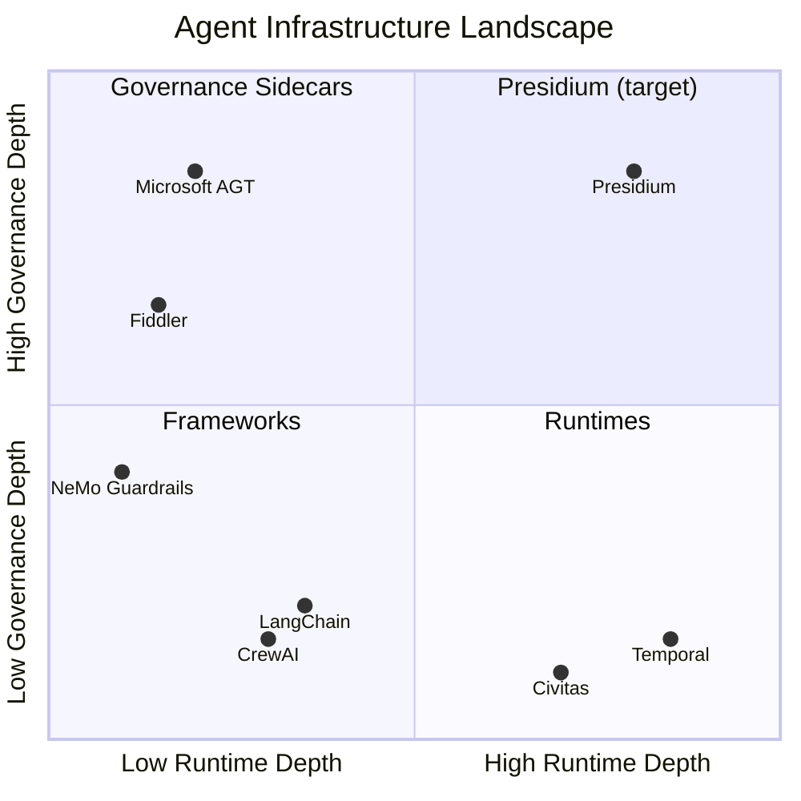

# Market Positioning

> Where Presidium sits in the agent infrastructure landscape.

## The Landscape (April 2026)

### Agent Runtimes

| Project | Funding | What It Does | Gap |
|---|---|---|---|
| **Temporal** | $300M, $5B valuation | Durable execution, workflow orchestration | No governance, no agent-native primitives |
| **Civitas** | OSS (solo maintainer) | OTP-style supervision, message passing, transports | No policy enforcement, no identity management |
| **Inngest** | $20M Series A | Serverless durable functions | No agent-specific features |
| **Restate** | $7M seed | Lightweight durable execution | Early stage, no governance |

### Governance / Safety

| Project | Funding | What It Does | Gap |
|---|---|---|---|
| **Microsoft AGT** | Microsoft-backed | 10/10 OWASP coverage, policy engine, zero-trust identity | No runtime — sidecar only, 540K LOC complexity |
| **Fiddler** | $100M Series C | Observability, guardrails, Trust Models, compliance | No runtime — watches agents, doesn't run them |
| **NVIDIA NeMo Guardrails** | NVIDIA-backed | LLM input/output guardrails | Narrow scope — content safety only |

### Agent Frameworks

| Project | Funding | What It Does | Gap |
|---|---|---|---|
| **LangChain/LangGraph** | $125M, $1.25B valuation | Agent building, orchestration, LangSmith observability | No fault tolerance, no governance |
| **CrewAI** | $18M Series A | Multi-agent orchestration with roles/goals | No supervision, no policy enforcement |
| **OpenAI Agents SDK** | OpenAI-backed | Agent building with tool calling | Minimal runtime, no governance |

## The 2x2

**Presidium occupies the only empty quadrant: deep runtime + deep governance.**

## Competitive Differentiation

### vs. Microsoft AGT

| Dimension | AGT | Presidium |
|---|---|---|
| Architecture | Governance sidecar (bolt-on) | Governance built into runtime (native) |
| Complexity | 9 packages, 540K LOC, 5 languages | Single coherent platform, Python-only |
| Developer experience | Enterprise-first, complex setup | Developer-first, `pip install presidium` |
| Runtime | None — observes/constrains external agents | Full Civitas runtime (supervision, messaging) |
| Philosophy | "Secure what you've built" | "Build governed systems natively" |
| Vendor gravity | Azure integrations, Microsoft brand | Vendor-neutral, no cloud dependency |

### vs. Fiddler

| Dimension | Fiddler | Presidium |
|---|---|---|
| Layer | Observability + safety (watches agents) | Runtime + governance (runs agents) |
| Buyer | Trust & Safety, Security teams | Platform Engineering, Agent developers |
| Deployment | SaaS — agents send data to Fiddler | Library — agents run on Presidium |
| Relationship | **Complementary** — Presidium generates telemetry, Fiddler analyzes it |

### vs. Temporal

| Dimension | Temporal | Presidium |
|---|---|---|
| Model | Durable execution (workflow replay) | Actor model (supervision trees) |
| Agent-native | Retrofitted for agents | Built for agents from day one |
| Governance | None | Policy engine, registry, gateways |
| Infrastructure | Requires Temporal cluster | Runs in-process, scales to distributed |
| Pricing | Usage-based cloud service | OSS core + optional managed cloud |

## Target Users

### Primary: Agent Platform Engineers

Teams building internal agent platforms at companies with 5+ agents in production.
They need: reliability, governance, observability, scaling — not another framework.

### Secondary: Agent Developers

Individual developers building multi-agent systems who want supervision
and governance without assembling 5 different tools.

### Tertiary: Enterprise Security/Compliance

Teams evaluating agent infrastructure against OWASP, NIST AI RMF, EU AI Act.
They need: audit trails, policy enforcement, compliance evidence.

## Positioning Statement

> **For** teams building production AI agent systems
> **who need** both reliability and governance,
> **Presidium is** the governed agent platform
> **that** provides fault-tolerant runtime and native policy enforcement in one architecture.
> **Unlike** governance sidecars (AGT) or runtime-only platforms (Temporal),
> **Presidium** makes governance architectural — policies are supervisor constraints, not external interceptors.
