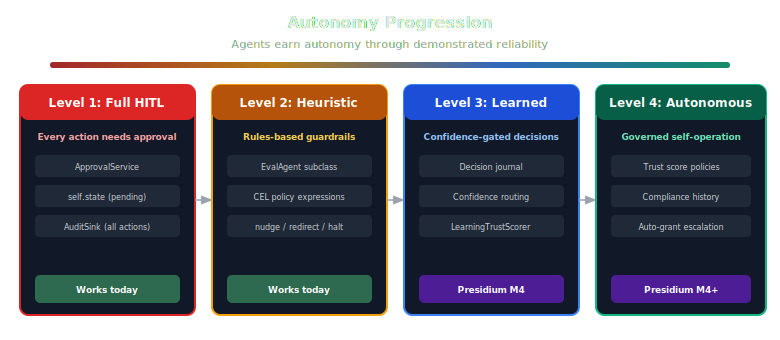

# Roadmap

> Phase-based development plan for Presidium.

## Philosophy

Documentation-driven development. Design docs and RFCs are written and reviewed before implementation begins. Each milestone (M) represents a coherent, shippable increment.

---

## M1: Foundation

**Goal:** Establish project identity, architecture, and documentation.

**Status:** Complete

- [x] Repository setup (monorepo, uv workspace, CI/CD)
- [x] AGENTS.md
- [x] Vision documents (manifesto, positioning, roadmap)
- [x] Architecture overview and package map
- [x] Interface-first architecture decisions (2-package structure, CEL default, library-first)
- [x] Competitive research archive
- [x] CNCF standards alignment principle (SPIFFE, OTEL, CEL)
- [ ] RFC-001: Presidium scope and boundaries (draft exists, needs finalization)
- [x] Design doc: Agent Registry (requirements + design + research, reviewed)
- [x] Design doc: Policy Engine (requirements + design, reviewed)
- [x] Design doc: Credential Provider (requirements + design)
- [x] Design doc: Approval Service (requirements + design)
- [x] Design doc: Audit Enricher (requirements + design)
- [x] Design doc: Topology Integration (requirements + design)
- [x] Agent registry industry research (AWS, Google, Microsoft, IBM, SPIFFE, K8s RBAC)
- [x] Full M2 design review (Oracle + consistency check, 12/12 issues resolved)
- [x] RFC-002: Multi-dimensional evaluation (seed for post-M4 investigation)
- [ ] Community feedback on architecture

**Deliverable:** Complete documentation. No code.

---

## M2: Core Interfaces + CEL Policy

**Goal:** All Protocol definitions in `presidium` core, plus working library-mode defaults. A developer can `pip install presidium` and have complete in-process governance.

**Status:** Complete. 245 tests, 95% coverage, mypy strict, ruff clean. Integration tests passing.

- [x] Requirements and design for all 9 components (35 design decisions, 12 review issues resolved)
- [x] `presidium` package — Protocol definitions + default implementations:
  - `AgentRegistry` + `InMemoryRegistry` / `SqliteRegistry` — SPIFFE-compatible `presidium://` identity, Ed25519 binding, K8s-style grants with CEL conditions, `trust_events` history table
  - `PolicyEngine` + `CelPolicyEngine` — 3 evaluation stages (pre_tool, pre_llm, registration), fail-closed, advisory/soft/hard enforcement modes, multi-stage rules
  - `CredentialProvider` + `EnvCredentialProvider` / `FileCredentialProvider` — grant-based credential access (`credential:{name}`), structured logging
  - `TrustScorer` + `LinearTrustScore` — 0.0-1.0, 3 tiers, lazy-on-read decay, materialize-on-write
  - `ApprovalService` + `CallbackApprovalProvider` — async HITL with 5-min default timeout, fail-closed
  - `AuditEnricher` + `InProcessAuditEnricher` — middleware sink, re-enrichment guard, fail-open enrichment
  - `GovernedModelProvider` — wraps ModelProvider, evaluates pre_llm policies
  - `GovernedToolProvider` — wraps ToolProvider, evaluates pre_tool policies
- [x] `GovernedRuntime` — programmatic constructor + `from_config()` YAML-based construction
- [x] 2 Civitas changes: add `"presidium"` to known keys + add `from_config_dict()` classmethod
- [x] Integration tests (compliant agent, denied agent, approval-gated, from_config YAML loading)
- [x] Getting started guide

**Deliverable:** `pip install presidium` — complete library-mode governance. No sidecars, no infrastructure, no Rego.

---

## M3: Contrib Adapters + Reference Impls

**Goal:** `presidium-contrib` with adapters for existing products and reference implementations for novel components. Post-execution evaluation stages. Service mode for distributed deployment.

- [ ] `presidium-contrib` package (second workspace member)
- [ ] Post-execution evaluation stages in `presidium` core:
  - `POST_TOOL` — validate tool outputs (PII detection, result filtering, size limits)
  - `POST_LLM` — validate LLM responses (schema compliance, content policy)
  - `pre_message` — agent-to-agent message governance (requires Civitas MessageBus hook)
- [ ] Adapters (existing products):
  - `OPAPolicyEngine` — wraps OPA REST API for teams with existing Rego policies
  - `CedarPolicyEngine` — Cedar authorization model
  - `OpenBaoCredentialProvider` — OpenBao/Vault-compatible KV engine with token renewal (MPL 2.0, OpenSSF Sandbox)
  - `AgentGatewayAdapter` — routes LLM + MCP calls through AgentGateway (Linux Foundation, CEL-native, OTEL)
  - `SlackApprovalService` — approval requests via Slack with approve/deny buttons
  - `TemporalApprovalService` — human task workflows via Temporal
  - `WebhookApprovalProvider` — POST approval requests to webhook URL, listen for callbacks
- [ ] Reference implementations (novel):
  - `PostgresAgentRegistry` — agent records, grant sets, trust score history in Postgres
  - `MCPGovernedToolProvider` — full MCP governance: ACL, tool poisoning detection, credential redaction, output PII masking
  - `LearningTrustScorer` — starts rule-based, learns from decision journal over time
- [ ] Service mode GenServer wrappers for registry, policy, and trust scoring
- [ ] Policy hot-reload without restart
- [ ] Concurrent grant modification (optimistic concurrency for service mode)
- [ ] `pip install presidium-contrib[opa]`, `presidium-contrib[openbao]`, `presidium-contrib[slack]`, `presidium-contrib[agentgateway]` extras

**Deliverable:** `pip install presidium-contrib[opa,openbao,slack,agentgateway]`

---

## M4: Autonomy Progression

**Goal:** Close the feedback loop. Agents earn autonomy through demonstrated reliability.

- [ ] Decision journal GenServer — records (action, context, outcome, human_decision) for every HITL interaction
- [ ] Confidence-gated routing — automatic HITL when agent confidence falls below threshold
- [ ] Heuristic-to-learned policy progression — `RuleBasedTrustScorer` hands off to `LearningTrustScorer` as data accumulates
- [ ] Composite trust scoring — combines audit signals, eval scores, and human approval patterns
- [ ] Autonomy level API — agents can query their current autonomy level and what's needed to increase it
- [ ] Design doc: Autonomy Progression

**Deliverable:** Agents that start constrained and earn autonomy through behavior.

---

## M5: SDK + CLI

**Goal:** One package, one install, complete experience.

- [ ] `presidium` package unified imports: `from presidium import GovernedRuntime, Policy, AgentRecord`
- [ ] CLI: `presidium run`, `presidium policy validate`, `presidium registry list`, `presidium trust show`
- [ ] Comprehensive documentation site (MkDocs)
- [ ] Example applications (3-5 real-world scenarios)
- [ ] v0.1.0 release

**Deliverable:** `pip install presidium` — the full experience, documented and released.

---

## M6: Cloud

**Goal:** Managed service and enterprise features.

- [ ] Presidium Cloud (managed runtime + governance)
- [ ] Enterprise features (SSO, RBAC, SOC 2 compliance)
- [ ] Compliance automation (EU AI Act, NIST AI RMF mapping)
- [ ] Multi-region deployment
- [ ] SLA guarantees
- [ ] Pricing tiers (Free → Starter → Pro → Enterprise)

**Deliverable:** Commercial offering.

---

## Future Investigation: Multi-Dimensional Evaluation

> See [RFC-002](../rfcs/002-multi-dimensional-evaluation.md)

Current LLM evaluation collapses high-dimensional, non-deterministic outputs to scalar scores. This is a category error — the evaluation output should be distributional and multi-dimensional (per-dimension means with confidence intervals, context, and caveats), not a single number.

The M2 `TrustScorer` ships as a simple 0.0-1.0 scalar. Post-M4, investigate replacing scalar trust with distributional trust profiles: per-dimension scores with uncertainty bounds, context-dependent trust, and explicit caveats. This is a research-first effort — the questions in RFC-002 need answers before any design work.

---

## Timeline

These are aspirational, not commitments. Adjusted based on community feedback and contributor availability.

| Milestone | Target | Status |
|---|---|---|
| M1: Foundation | Q2 2026 | Complete |
| M2: Core Interfaces + CEL Policy | Q3 2026 | Complete |
| M3: Contrib Adapters + Reference Impls | Q3-Q4 2026 | Planning |
| M4: Autonomy Progression | Q4 2026 | Planning |
| M5: SDK + CLI | Q1 2027 | Planning |
| M6: Cloud | 2027+ | Future |
