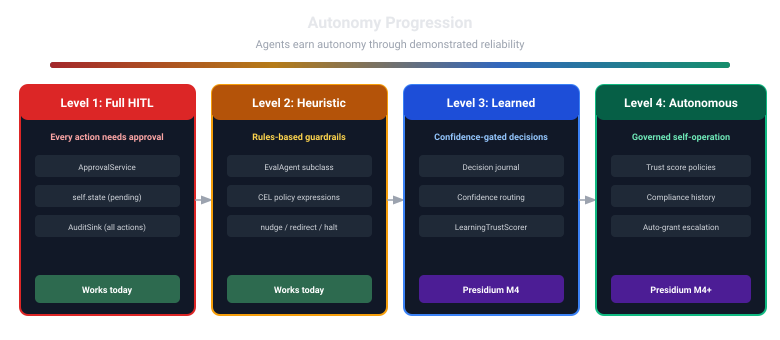

# Roadmap

> Phase-based development plan for Presidium.

## Philosophy

Documentation-driven development. Design docs and RFCs are written and reviewed before implementation begins. Each milestone (M) represents a coherent, shippable increment.

---

## M1: Foundation

**Goal:** Establish project identity, architecture, and documentation.

**Status:** Complete

- [x] Repository setup (monorepo, uv workspace, CI/CD)
- [x] AGENTS.md
- [x] Vision documents (manifesto, positioning, roadmap)
- [x] Architecture overview and package map
- [x] Interface-first architecture decisions (2-package structure, CEL default, library-first)
- [x] Competitive research archive
- [x] CNCF standards alignment principle (SPIFFE, OTEL, CEL)
- [ ] RFC-001: Presidium scope and boundaries (draft exists, needs finalization)
- [x] Design doc: Agent Registry (requirements + design + research, reviewed)
- [x] Design doc: Policy Engine (requirements + design, reviewed)
- [x] Design doc: Credential Provider (requirements + design)
- [x] Design doc: Approval Service (requirements + design)
- [x] Design doc: Audit Enricher (requirements + design)
- [x] Design doc: Topology Integration (requirements + design)
- [x] Agent registry industry research (AWS, Google, Microsoft, IBM, SPIFFE, K8s RBAC)
- [x] Full M2 design review (Oracle + consistency check, 12/12 issues resolved)
- [x] RFC-002: Multi-dimensional evaluation (seed for post-M4 investigation)
- [ ] Community feedback on architecture

**Deliverable:** Complete documentation. No code.

---

## M2: Core Interfaces + CEL Policy

**Goal:** All Protocol definitions in `presidium` core, plus working library-mode defaults. A developer can `pip install presidium` and have complete in-process governance.

**Status:** Complete. 245 tests, 95% coverage, mypy strict, ruff clean. Integration tests passing.

- [x] Requirements and design for all 9 components (35 design decisions, 12 review issues resolved)
- [x] `presidium` package — Protocol definitions + default implementations:
  - `AgentRegistry` + `InMemoryRegistry` / `SqliteRegistry` — SPIFFE-compatible `presidium://` identity, Ed25519 binding, K8s-style grants with CEL conditions, `trust_events` history table
  - `PolicyEngine` + `CelPolicyEngine` — 3 evaluation stages (pre_tool, pre_llm, registration), fail-closed, advisory/soft/hard enforcement modes, multi-stage rules
  - `CredentialProvider` + `EnvCredentialProvider` / `FileCredentialProvider` — grant-based credential access (`credential:{name}`), structured logging
  - `TrustScorer` + `LinearTrustScore` — 0.0-1.0, 3 tiers, lazy-on-read decay, materialize-on-write
  - `ApprovalService` + `CallbackApprovalProvider` — async HITL with 5-min default timeout, fail-closed
  - `AuditEnricher` + `InProcessAuditEnricher` — middleware sink, re-enrichment guard, fail-open enrichment
  - `GovernedModelProvider` — wraps ModelProvider, evaluates pre_llm policies
  - `GovernedToolProvider` — wraps ToolProvider, evaluates pre_tool policies
- [x] `GovernedRuntime` — programmatic constructor + `from_config()` YAML-based construction
- [x] 2 Civitas changes: add `"presidium"` to known keys + add `from_config_dict()` classmethod
- [x] Integration tests (compliant agent, denied agent, approval-gated, from_config YAML loading)
- [x] Getting started guide

**Deliverable:** `pip install presidium` — complete library-mode governance. No sidecars, no infrastructure, no Rego.

---

## M3: Contrib Adapters + Trust Scoring Foundation

**Goal:** `presidium-contrib` with adapters for existing products and reference implementations. Trust scoring enhancements for enterprise adoption: windowed aggregation, controllability, cold-start, spec introspection, bounded learning. Post-execution evaluation stages.

**Requirements:** [trust-scoring-requirements.md](../design/trust-scoring-requirements.md) (FR-3.1–3.8, FR-E.1–E.6)

- [x] `presidium-contrib` package (second workspace member)
- [x] Post-execution evaluation stages: `POST_TOOL`, `POST_LLM`
- [x] Adapters: `OPAPolicyEngine`, `OpenBaoCredentialProvider`, `AgentGatewayClient`, `SlackApprovalService`, `WebhookApprovalProvider`
- [x] Reference impls: `PostgresAgentRegistry`, `LearningTrustScorer` (refactored to use `presidium.scoring` library)
- [x] Trust scoring enhancements (presidium core):
  - Windowed aggregation — last N events or last T hours (FR-3.1)
  - Exponential decay opt-in with configurable half-life (FR-3.2)
  - Controllability filter — `controllable: bool` on events (FR-3.3)
  - Cold-start strategies — optimistic, neutral, pessimistic (FR-3.4)
  - Spec introspection — `IntrospectableScorer` Protocol with `ScoringSpec` + `spec_hash` (FR-3.5)
  - Bounded learning with max weight delta and rate limiting (FR-3.7)
  - Reason surfacing — `QueryableScorer` Protocol (FR-3.8)
- [x] Enterprise requirements:
  - Spec pinning for compliance periods (FR-E.1)
  - Override attribution — `actor_id` required on HUMAN_OVERRIDE (FR-E.2)
  - Performance budget — <1ms p99 reads (FR-E.3)
  - Zero-downtime M2→M3 migration (FR-E.4)
  - Determinism contract on scorers (FR-E.5)
  - OpenTelemetry spans for trust operations (FR-E.6)
- [ ] Deferred adapters: `CedarPolicyEngine`, `TemporalApprovalService`
- [x] `pre_message` evaluation stage (Civitas MessageBus hook via `GovernedMessageBus`)
- [x] MCP governance reference impl (tool poisoning, credential redaction, PII masking)
- [x] Service mode GenServer wrappers (`PolicyEvaluatorServer`, `RegistryServer`)
- [x] Policy hot-reload without restart (`GovernedRuntime.reload_policies()`)

**Deliverable:** `pip install presidium-contrib[opa,openbao,slack,agentgateway]` + enterprise-ready trust scoring

---

## M4: Autonomy Progression

**Goal:** Close the feedback loop. Agents earn autonomy through demonstrated reliability. Multi-dimensional trust scoring. Capability gating by tier. Decision journal for full auditability.

**Requirements:** [trust-scoring-requirements.md](../design/trust-scoring-requirements.md) (FR-4.1–4.6)

- [ ] Multi-dimensional trust scoring — `MultiDimensionalTrustScorer` Protocol with per-dimension scores and configurable aggregation (FR-4.1)
- [ ] Capability gating — tier-to-capability mapping via `CapabilityGate`, CEL references `agent.trust.capabilities` (FR-4.2)
- [ ] Graduated deactivation — `TierUpgraded`/`TierDegraded` events, subscriber pattern, no binary kill switch (FR-4.3)
- [ ] Confidence-gated routing — `ConfidenceRouter` selects agents or escalates to human (FR-4.4)
- [ ] Decision journal — all routing decisions and tier transitions recorded with trust snapshots (FR-4.5)
- [ ] Trust spec export — JSON, Markdown, detached JWS for tamper-evidence (FR-4.6)
- [ ] Heuristic-to-learned progression — `LearningTrustScorer` activates after data threshold
- [ ] Autonomy level API — agents query current level and promotion criteria
- [ ] Design doc: Autonomy Progression

**Deliverable:** Agents that start constrained and earn autonomy through behavior. Full decision audit trail.

---

## M5: SDK + CLI

**Goal:** One package, one install, complete experience. Trust CLI for operators.

**Requirements:** [trust-scoring-requirements.md](../design/trust-scoring-requirements.md) (FR-5.1–5.3)

- [ ] CLI: `presidium trust show`, `presidium trust events`, `presidium trust spec`, `presidium trust replay` (FR-5.1)
- [ ] Event export — JSON Lines, CSV with embedded `spec_hash` (FR-5.2)
- [ ] Deterministic replay — reproduce scores from historical events + spec (FR-5.3)
- [ ] CLI: `presidium run`, `presidium policy validate`, `presidium registry list`
- [ ] Comprehensive documentation site (MkDocs)
- [ ] Example applications (3-5 real-world scenarios)
- [ ] v1.0.0 release

**Deliverable:** `pip install presidium` — the full experience, documented and released.

---

## M6: Cloud

**Goal:** Managed service and enterprise features. Trust feedback loop measurement. Compliance reporting.

**Requirements:** [trust-scoring-requirements.md](../design/trust-scoring-requirements.md) (FR-6.1–6.4)

- [ ] Multi-tenant trust isolation — events, specs, audits partitioned by tenant (FR-6.1)
- [ ] Centralized event store — REST + gRPC, idempotent submissions (FR-6.2)
- [ ] Feedback loop metric — % of agents recovering from RESTRICTED to STANDARD+ (FR-6.3)
- [ ] Compliance reports — NIST AI RMF, ISO/IEC 42001 mappings (FR-6.4)
- [ ] Presidium Cloud (managed runtime + governance)
- [ ] Enterprise features (SSO, RBAC, SOC 2 compliance)
- [ ] Multi-region deployment
- [ ] SLA guarantees
- [ ] Pricing tiers (Free → Starter → Pro → Enterprise)

**Deliverable:** Commercial offering with trust analytics and compliance automation.

---

## Future Investigation: Multi-Dimensional Evaluation

> See [RFC-002](../rfcs/002-multi-dimensional-evaluation.md)

Current LLM evaluation collapses high-dimensional, non-deterministic outputs to scalar scores. This is a category error — the evaluation output should be distributional and multi-dimensional (per-dimension means with confidence intervals, context, and caveats), not a single number.

The M2 `TrustScorer` ships as a simple 0.0-1.0 scalar. Post-M4, investigate replacing scalar trust with distributional trust profiles: per-dimension scores with uncertainty bounds, context-dependent trust, and explicit caveats. This is a research-first effort — the questions in RFC-002 need answers before any design work.

---

## Timeline

These are aspirational, not commitments. Adjusted based on community feedback and contributor availability.

| Milestone | Target | Status |
|---|---|---|
| M1: Foundation | Q2 2026 | Complete |
| M2: Core Interfaces + CEL Policy | Q3 2026 | Complete |
| M3: Contrib Adapters + Reference Impls | Q3-Q4 2026 | Complete |
| M4: Autonomy Progression | Q4 2026 | Planning |
| M5: SDK + CLI | Q1 2027 | Planning |
| M6: Cloud | 2027+ | Future |
